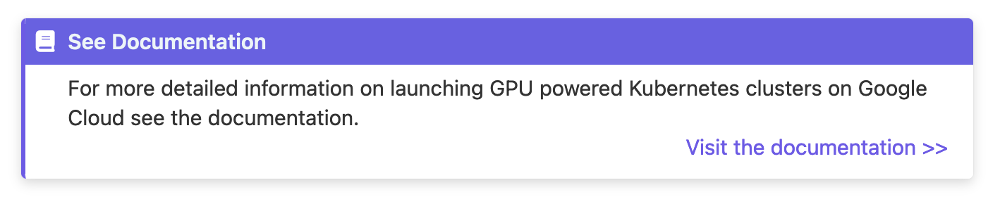
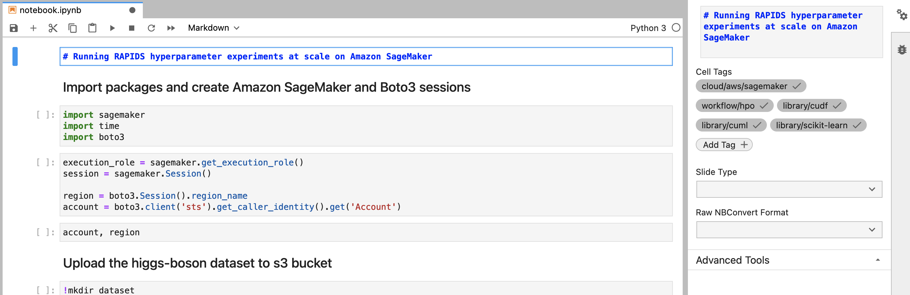
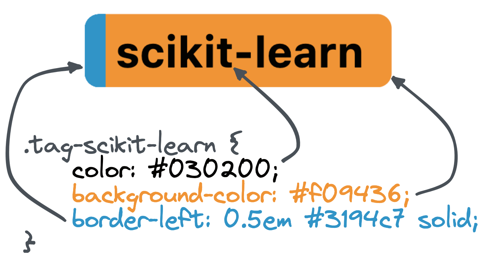

# Contributing to RAPIDS Deployment Documentation

## Building

For fast and consistent builds of the documentation we recommend running all build commands with [uv](https://docs.astral.sh/uv/getting-started/installation/) and `uv run`.
Build dependencies are stored in `pyproject.toml` and locked with `uv.lock` to ensure reproducible builds.

To create a dedicated environment follow the instructions in the [uv docs](https://docs.astral.sh/uv/pip/environments/)
once it's created you can install all the packages from the `uv.lock` doing:

```bash
uv venv && uv sync --locked
```

The `uv.lock` file will ensure reproducible builds, but if you want to intentionally upgrade to newer versions of dependencies you can run

```bash
uv lock --upgrade
```

We also recommend building with [sphinx-autobuild](https://github.com/executablebooks/sphinx-autobuild).
This tool will build your docs and host them on a local web server.
It will watch for file changes, rebuild automatically and tell the browser page to reload. Magic!

```console
$ uv run sphinx-autobuild -b dirhtml source build/html
[sphinx-autobuild] Starting initial build
[sphinx-autobuild] > python -m sphinx build -b dirhtml source build/html
Running Sphinx v8.2.3
...

build succeeded.

The HTML pages are in build/html.
[sphinx-autobuild] Serving on http://127.0.0.1:8000
[sphinx-autobuild] Waiting to detect changes...
```

Alternatively you can build the static site into `build/html` with `sphinx`.

```bash
uv run make dirhtml
```

## Writing

Content in these docs are written in markdown using the [MyST Sphinx extension](https://myst-parser.readthedocs.io/en/v0.15.1/syntax/syntax.html).

### Custom admonitions

This Sphinx site has some custom admonitions to help when writing.

#### Docref

You can link to another documentation page with a `docref` admonition.

````markdown
```{docref} /cloud/gcp/gke
For more detailed information on launching GPU powered Kubernetes clusters on Google Cloud see the documentation.
```
````

Renders as:



> **Note**
> The `Visit the documentation >>` link is added automatically in the bottom right based on the page that is referenced in the directive argument.

### Documentation style guide

#### Kubernetes

The [Kubernetes documentation style-guide](https://kubernetes.io/docs/contribute/style/style-guide/#use-upper-camel-case-for-api-objects)  
encourages the use of `UpperCamelCase` (also known as `PascalCase`) when referring to Kubernetes resources.
Please make sure to follow this guide when writing documentation that involves Kubernetes.

#### Usage of console and bash blocks

- Use `console` for any set of commands that are entered in a command line that contain output from the command.
  - Start the line with `$`, they'll be omitted upon copying in sphinx rendered docs.
  - Use `\` to break lines.
  - Do not add comments like `# comment` in-line when using break lines because this will break the copying.
- Use `bash` for any bash script `.sh`, or command line entry without output.

### Notebooks

The `examples` section of these docs are written in Jupyter Notebooks and built with [MyST-NB](https://myst-nb.readthedocs.io/en/latest/).

There is also a custom Sphinx extension which shows the examples in a gallery with helpful cross linking throughout the docs. This does mean there
are a few assumptions about how notebooks should be written.

#### Adding examples

1. Create a new directory inside `source/examples`.
2. Create a new notebook file in that directory and give it a name like `notebook.ipynb`.
   - The first cell of your notebook should be a markdown cell and contain at least a top level header.
   - You can add tags to your notebook by adding [cell metadata tags to the first cell](https://jupyterbook.org/en/stable/content/metadata.html).
3. Place any supporting files such as scripts, Dockerfiles, etc in the same directory. These files will be discovered and listed on the rendered notebook page.
4. Update the `notebookgallerytoctree` section in `source/examples/index.md` with the relative path to your new notebook.

#### Tags

The notebook gallery extension uses cell tags to organize and cross-reference files.



Tags are hierarchical and use slashes to separate their namespaces. For example if your notebook uses AWS Sagemaker you should add the tag `cloud/aws/sagemaker`. This aligns with the Sphinx doc path to the RAPIDS Sagemaker documentation page which you can find in `source/cloud/aws/sagemaker.md`.

The extension will use this information to ensure the notebook is linked from the Sagemaker page under the "Related Examples" section.

The example gallery will also allow you to filter based on these tags. The root of the tag namespace is used to create the filtering categories. So in the above example the `cloud/aws/sagemaker` tag would create a filter for `cloud` with an option of `aws/sagemaker`. You can create new filter sections simply by creating new tags with unique root namespaces, but be mindful that keeping the number of filtering sections to a minimum will provide users with the best user experience and there may already be a suitable root namespace for the tag you want to create.

##### Styling

By default tags are styled with RAPIDS purple backgrounds and white text. They also have a `0.5em` left hand border to use as an accent that is also purple by default which can be styled for a two-tone effect.

<div style="width: 100%; text-align: center;">

</div>

This can be overridden for each tag by adding a new class with the format `.tag-{name}` to `source/_static/css/custom.css`. For example the Scikit-Learn logo is orange and blue with grey text, so the custom CSS sets an orange background with a blue accent and grey text.

```css
.tag-scikit-learn {
  color: #030200;
  background-color: #f09436;
  border-left: 0.5em #3194c7 solid;
}
```

Tag styling can be added at any domain level, for example the `cloud/aws/sagemaker` tag uses the `.tag-cloud`, `.tag-aws` and `.tag-sagemaker` classes. They will be applied in that order too so we can set a default AWS style which can be overridden on a service-by-service basis.

## Linting

This project uses [prettier](https://prettier.io/) and [markdownlint](https://github.com/DavidAnson/markdownlint) to enforce automatic formatting and consistent style as well as identify rendering issues early.

It is recommended to run this automatically on each commit using [pre-commit](https://pre-commit.com/) as linting rules are enforced via CI checks and linting locally will save time in code review.

```console
$ pre-commit install
pre-commit installed at .git/hooks/pre-commit

$ git commit -am "My awesome commit"
prettier.................................................................Passed
markdownlint.............................................................Passed
```

## Releasing

This repository is continuously deployed via the [build-and-deploy](https://github.com/rapidsai/deployment/blob/main/.github/workflows/build-and-deploy.yml) workflow. Every commit to `main` is built to static HTML and published to the [latest documentation at docs.nvidia.com](https://docs.nvidia.com/datascience/deployment/latest/).

Pushing a release tag (`vYY.MM.PP`, for example `v26.08.00`) builds that commit with the stable configuration and publishes it to `https://docs.nvidia.com/datascience/deployment/YY.MM/`. Released versions stay available side by side and the version switcher in the navigation bar moves between them. Alpha tags (`vYY.MM.PPa`) do not publish anything. The switcher data (`versions.json`) and the publish target are produced by the build itself, see `extensions/rapids_docs_publishing.py`; the workflow only uploads them.

The old `docs.rapids.ai/deployment/{stable,nightly}/` URLs redirect to the latest documentation on docs.nvidia.com. Those redirects live in the [rapidsai/docs](https://github.com/rapidsai/docs) repository (`_redirects`).

The RAPIDS versions for things like container images and install instructions are templated into the documentation pages and are stored in `source/conf.py`.

```python
versions = {
    "stable": {
        "rapids_container": "nvcr.io/nvidia/rapidsai/base:26.06-cuda12-py3.13",
    },
    "nightly": {
        "rapids_container": "rapidsai/base:26.08a-cuda12-py3.13",
    },
}
```

These can then be referenced in templating statements.
For most text, use Jinja2-style `{{` and `}}`, like this:

```markdown
# My doc page

The latest container image is {{ rapids_container }}.
```

For inline URLs, the templating will only work if the entire URL contains URL-valid characters.
In those cases, use `~~~` with no spaces, like this:

```markdown
# My doc page

For more, see the docs on [dask-cuda](https://docs.rapids.ai/api/dask-cuda/~~~rapids_api_docs_version~~~/install.html)
```

All builds will use the nightly section by default which allows you to test with the latest and greatest containers when developing locally or previewing nightly docs builds. To build the docs using the stable images you need to set the environment variable `DEPLOYMENT_DOCS_BUILD_STABLE` to `true`. This is done automatically when building from a tag in CI. The version switcher in the navigation bar only appears in CI builds (the workflow sets `RAPIDS_DOCS_PUBLISH=true`). Local and preview builds leave it out because the browser would refuse to load `versions.json` from docs.nvidia.com across origins.

To reproduce a CI build locally, including the `build/publish` directory with `versions.json`, run:

```bash
RAPIDS_DOCS_PUBLISH=true RAPIDS_DOCS_RELEASE_TAGS="$(git tag --list)" uv run make dirhtml SPHINXOPTS="-W --keep-going -n"
```

Before you publish a new version for a release ensure that the latest container images are available and then update the `stable` config to use the new release version and update `nightly` to use the next upcoming nightly.

Then push a release tag. The tag must have the form `vYY.MM.PP` for the workflow to publish it.

```bash
# Set the release version
# See https://docs.rapids.ai/resources/versions/ and past releases for version scheme
export RELEASE=vYY.MM.00

# Create the tag
git tag -a $RELEASE -m "Version $RELEASE"

# Push
git push upstream $RELEASE
```

### Fixing a released version

To correct the documentation of a release that has already been published, branch from its tag, commit the fix and push a new patch tag. The patch number is dropped from the published path, so `v26.08.01` republishes `https://docs.nvidia.com/datascience/deployment/26.08/`.

```bash
git checkout -b fix-26.08 v26.08.00
# ... commit the fix ...
git tag -a v26.08.01 -m "Version v26.08.01"
git push upstream v26.08.01
```

## Developer Certificate of Origin

All contributions to this project must be accompanied by a sign-off indicating that the contribution is made pursuant to the Developer Certificate of Origin (DCO). This is a lightweight way for contributors to certify that they wrote or otherwise have the right to submit the code they are contributing to the project.

The DCO is a simple statement that you, as a contributor, have the legal right to make the contribution. To certify your adherence to the DCO, you must sign off on your commits. This is done by adding a `Signed-off-by` line to your commit messages:

```txt
Signed-off-by: Random J Developer <random@developer.example.org>
```

You can do this automatically with `git commit -s`.

Here is the full text of the DCO, which you can also find at <https://developercertificate.org/>:

```txt
Developer's Certificate of Origin 1.1

By making a contribution to this project, I certify that:

(a) The contribution was created in whole or in part by me and I
    have the right to submit it under the open source license
    indicated in the file; or

(b) The contribution is based upon previous work that, to the best
    of my knowledge, is covered under an appropriate open source
    license and I have the right under that license to submit that
    work with modifications, whether created in whole or in part
    by me, under the same open source license (unless I am
    permitted to submit under a different license), as indicated
    in the file; or

(c) The contribution was provided directly to me by some other
    person who certified (a), (b) or (c) and I have not modified
    it.

(d) I understand and agree that this project and the contribution
    are public and that a record of the contribution (including all
    personal information I submit with it, including my sign-off) is
    maintained indefinitely and may be redistributed consistent with
    this project or the open source license(s) involved.
```
