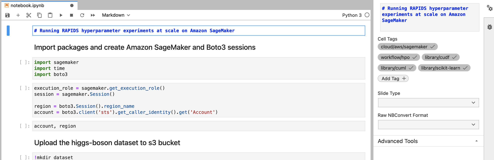
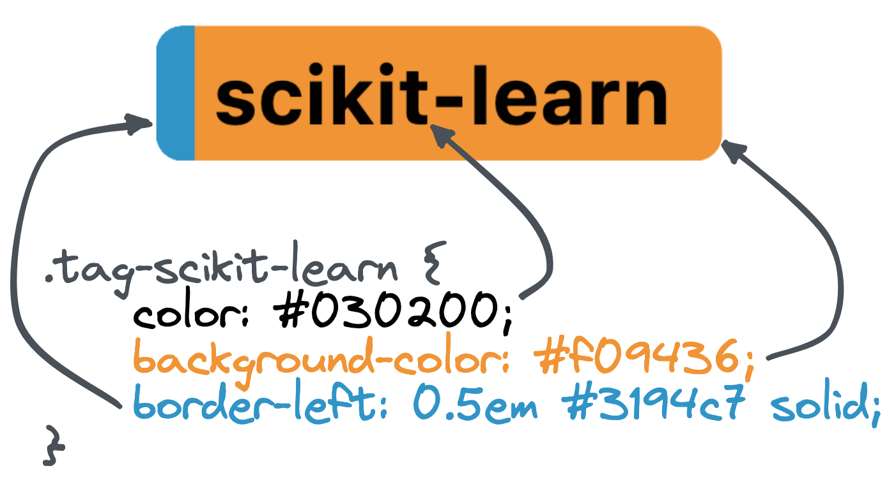

# RAPIDS Deployment Documentation

## Building

For fast and consistent builds of the documentation we recommend running all build commands with [uv](https://docs.astral.sh/uv/getting-started/installation/) and `uv run`.
Build dependencies are stored in `pyproject.toml` and locked with `uv.lock` to ensure reproducible builds.

To create a dedicated environment follow the instructions in the [uv docs](https://docs.astral.sh/uv/pip/environments/)
once it's created you can install all the packages from the `uv.lock` doing:

```bash
uv venv && uv sync --locked
```

The `uv.lock` file will ensure reproducible builds, but if you want to intentionally upgrade to newer versions of dependencies you can run

```bash
uv lock --upgrade
```

We also recommend building with [sphinx-autobuild](https://github.com/executablebooks/sphinx-autobuild).
This tool will build your docs and host them on a local web server.
It will watch for file changes, rebuild automatically and tell the browser page to reload. Magic!

```console
$ uv run sphinx-autobuild -b dirhtml source build/html
[sphinx-autobuild] Starting initial build
[sphinx-autobuild] > python -m sphinx build -b dirhtml source build/html
Running Sphinx v8.2.3
...

build succeeded.

The HTML pages are in build/html.
[sphinx-autobuild] Serving on http://127.0.0.1:8000
[sphinx-autobuild] Waiting to detect changes...
```

Alternatively you can build the static site into `build/html` with `sphinx`.

```bash
uv run make dirhtml
```

## Writing

Content in these docs are written in markdown using the [MyST Sphinx extension](https://myst-parser.readthedocs.io/en/v0.15.1/syntax/syntax.html).

### Custom admonitions

This Sphinx site has some custom admonitions to help when writing.

#### Docref

You can link to another documentation page with a `docref` admonition.

````markdown
```{docref} /cloud/gcp/gke
For more detailed information on launching GPU powered Kubernetes clusters on Google Cloud see the documentation.
```
````

Renders as:


> **Note**
> The `Visit the documentation >>` link is added automatically in the bottom right based on the page that is referenced in the directive argument.

### Documentation style guide

#### Kubernetes

The [Kubernetes documentation style-guide](https://kubernetes.io/docs/contribute/style/style-guide/#use-upper-camel-case-for-api-objects)  
encourages the use of `UpperCamelCase` (also known as `PascalCase`) when referring to Kubernetes resources.
Please make sure to follow this guide when writing documentation that involves Kubernetes.

### Notebooks

The `examples` section of these docs are written in Jupyter Notebooks and built with [MyST-NB](https://myst-nb.readthedocs.io/en/latest/).

There is also a custom Sphinx extension which shows the examples in a gallery with helpful cross linking throughout the docs. This does mean there
are a few assumptions about how notebooks should be written.

#### Adding examples

1. Create a new directory inside `source/examples`.
2. Create a new notebook file in that directory and give it a name like `notebook.ipynb`.
   - The first cell of your notebook should be a markdown cell and contain at least a top level header.
   - You can add tags to your notebook by adding [cell metadata tags to the first cell](https://jupyterbook.org/en/stable/content/metadata.html).
3. Place any supporting files such as scripts, Dockerfiles, etc in the same directory. These files will be discovered and listed on the rendered notebook page.
4. Update the `notebookgallerytoctree` section in `source/examples/index.md` with the relative path to your new notebook.

#### Tags

The notebook gallery extension uses cell tags to organize and cross-reference files.



Tags are hierarchical and use slashes to separate their namespaces. For example if your notebook uses AWS Sagemaker you should add the tag `cloud/aws/sagemaker`. This aligns with the Sphinx doc path to the RAPIDS Sagemaker documentation page which you can find in `source/cloud/aws/sagemaker.md`.

The extension will use this information to ensure the notebook is linked from the Sagemaker page under the "Related Examples" section.

The example gallery will also allow you to filter based on these tags. The root of the tag namespace is used to create the filtering categories. So in the above example the `cloud/aws/sagemaker` tag would create a filter for `cloud` with an option of `aws/sagemaker`. You can create new filter sections simply by creating new tags with unique root namespaces, but be mindful that keeping the number of filtering sections to a minimum will provide users with the best user experience and there may already be a suitable root namespace for the tag you want to create.

##### Styling

By default tags are styled with RAPIDS purple backgrounds and white text. They also have a `0.5em` left hand border to use as an accent that is also purple by default which can be styled for a two-tone effect.

<div style="width: 100%; text-align: center;">

</div>

This can be overridden for each tag by adding a new class with the format `.tag-{name}` to `source/_static/css/custom.css`. For example the Scikit-Learn logo is orange and blue with grey text, so the custom CSS sets an orange background with a blue accent and grey text.

```css
.tag-scikit-learn {
  color: #030200;
  background-color: #f09436;
  border-left: 0.5em #3194c7 solid;
}
```

Tag styling can be added at any domain level, for example the `cloud/aws/sagemaker` tag uses the `.tag-cloud`, `.tag-aws` and `.tag-sagemaker` classes. They will be applied in that order too so we can set a default AWS style which can be overridden on a service-by-service basis.

## Linting

This project uses [prettier](https://prettier.io/) and [markdownlint](https://github.com/DavidAnson/markdownlint) to enforce automatic formatting and consistent style as well as identify rendering issues early.

It is recommended to run this automatically on each commit using [pre-commit](https://pre-commit.com/) as linting rules are enforced via CI checks and linting locally will save time in code review.

```console
$ pre-commit install
pre-commit installed at .git/hooks/pre-commit

$ git commit -am "My awesome commit"
prettier.................................................................Passed
markdownlint.............................................................Passed
```

## Releasing

This repository is continuously deployed to the [nightly docs at docs.rapids.ai](https://docs.rapids.ai/deployment/nightly/) via the [build-and-deploy](https://github.com/rapidsai/deployment/blob/main/.github/workflows/build-and-deploy.yml) workflow. All commits to main are built to static HTML and pushed to the [`deployment/nightly` subdirectory in the rapidsai/docs repo](https://github.com/rapidsai/docs/tree/gh-pages/deployment) which in turn is published to GitHub Pages.

We can also update the [stable documentation at docs.rapids.ai](https://docs.rapids.ai/deployment/stable/) by creating and pushing a tag which will cause the `build-and-deploy` workflow to push to the [`deployment/stable` subdirectory](https://github.com/rapidsai/docs/tree/gh-pages/deployment) instead.

The RAPIDS versions for things like container images and install instructions are templated into the documentation pages and are stored in `source/conf.py`.

```python
versions = {
    "stable": {
        "rapids_container": "nvcr.io/nvidia/rapidsai/base:25.08-cuda12.9-py3.12",
    },
    "nightly": {
        "rapids_container": "rapidsai/base:25.10a-cuda12.9-py3.12",
    },
}
```

These can then be referenced in templating statements.
For most text, use Jinja2-style `{{` and `}}`, like this:

```markdown
# My doc page

The latest container image is {{ rapids_container }}.
```

For inline URLs, the templating will only work if the entire URL contains URL-valid characters.
In those cases, use `~~~` with no spaces, like this:

```markdown
# My doc page

For more, see the docs on [dask-cuda](https://docs.rapids.ai/api/dask-cuda/~~~rapids_api_docs_version~~~/install.html)
```

All builds will use the nightly section by default which allows you to test with the latest and greatest containers when developing locally or previewing nightly docs builds. To build the docs using the stable images you need to set the environment variable `DEPLOYMENT_DOCS_BUILD_STABLE` to `true`. This is done automatically when building from a tag in CI.

Before you publish a new version for a release ensure that the latest container images are available and then update the `stable` config to use the new release version and update `nightly` to use the next upcoming nightly.

Then you can push a tag to release.

```bash
# Set next version number
# See https://docs.rapids.ai/resources/versions/ and past releases for version scheme
export RELEASE=x.x.x

# Create tags
git commit --allow-empty -m "Release $RELEASE"
git tag -a $RELEASE -m "Version $RELEASE"

# Push
git push upstream --tags
```
