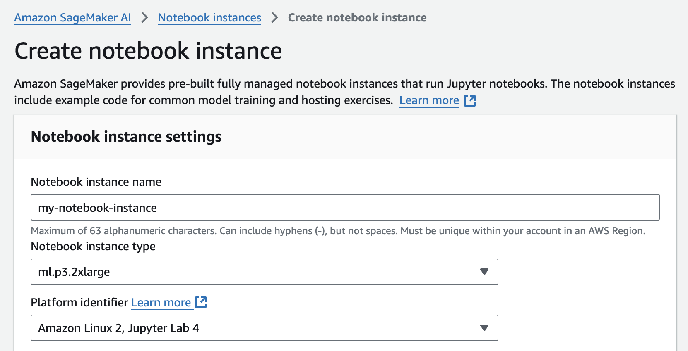
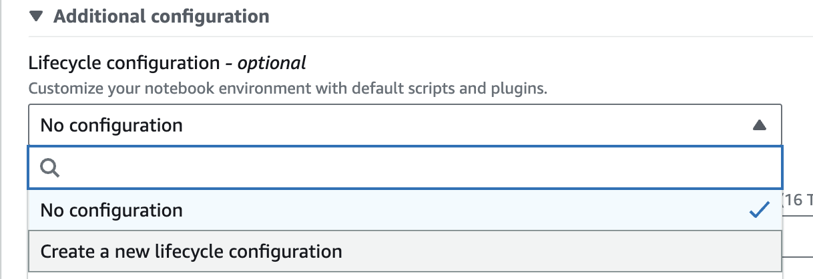
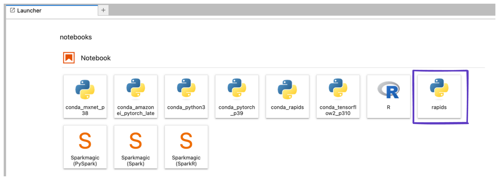

# SageMaker

RAPIDS can be used in a few ways with [AWS SageMaker](https://aws.amazon.com/sagemaker/).

## SageMaker Notebooks

To get started head to [the SageMaker console]((https://console.aws.amazon.com/sagemaker/) and create a [new SageMaker Notebook Instance](https://console.aws.amazon.com/sagemaker/home#/notebook-instances/create).

Choose `Notebook > Notebook Instances > Create notebook instance`.

### Select your instance

If a field is not mentioned below, leave the default values:

- **NOTEBOOK_INSTANCE_NAME** = Name of the notebook instance
- **NOTEBOOK_INSTANCE_TYPE** = Type of notebook instance. Select a RAPIDS-compatible GPU ([see the RAPIDS docs](https://docs.rapids.ai/install#system-req)) as the SageMaker Notebook instance type (e.g., `ml.p3.2xlarge`).
- **PLATFORM_IDENTIFIER** = 'Amazon Linux 2, Jupyter Lab 3'
- **IAM_ROLE** = Create a new role > Create role



### Create a RAPIDS lifecycle configuration

[SageMaker Notebook Instances](https://docs.aws.amazon.com/sagemaker/latest/dg/nbi.html) can be augmented with a RAPIDS conda environment.

We can add a RAPIDS conda environment to the set of Jupyter ipython kernels available in our SageMaker notebook instance by installing in a [lifecycle configuration script](https://docs.aws.amazon.com/sagemaker/latest/dg/notebook-lifecycle-config.html).

Create a new lifecycle configuration (via the 'Additional Options' dropdown).



Give your configuration a name like `rapids` and paste the following script into the "start notebook" script.

```bash
#!/bin/bash

set -e

sudo -u ec2-user -i <<'EOF'

mamba create -y -n rapids {{ rapids_conda_channels }} {{ rapids_conda_packages }} \
    boto3 \
    ipykernel \
    sagemaker

conda activate rapids

# optionally install AutoGluon for AutoML GPU demo
# python -m pip install --pre autogluon

python -m ipykernel install --user --name rapids
echo "kernel install completed"
EOF
```

Set the volume size to at least `15GB`, to accommodate the conda environment.

Then launch the instance.

### Select the RAPIDS environment

Once your Notebook Instance is `InService` select "Open JupyterLab"

```{note}
If you see Pending to the right of the notebook instance in the Status column, your notebook is still being created. The status will change to InService when the notebook is ready for use.
```

Then in Jupyter select the `rapids` kernel when working with a new notebook.



### Run the Example Notebook

Once inside JupyterLab you should be able to upload the [Running RAPIDS hyperparameter experiments at scale](/examples/rapids-sagemaker-higgs/notebook) example notebook and continue following those instructions.

## SageMaker Estimators

RAPIDS can also be used in [SageMaker Estimators](https://sagemaker.readthedocs.io/en/stable/api/training/estimators.html).
Estimators allow you to launch training jobs on ephemeral VMs which SageMaker manages for you.
With this option, your Notebook Isntance doesn't need to have a GPU... you are only charged for GPU instances for the time that your training job is running.

All you’ll need to do is bring in your RAPIDS training script and libraries as a Docker container image and ask Amazon SageMaker to run copies of it in parallel on a specified number of GPU instances.

Let’s take a closer look at how this works through a step-by-step approach:

- Training script should accept hyperparameters as command line arguments. Starting with the base RAPIDS container (pulled from [Docker Hub](https://hub.docker.com/u/rapidsai)), use a `Dockerfile` to augment it by copying your training code and set `WORKDIR` path to the code.

- Install [sagemaker-training toolkit](https://github.com/aws/sagemaker-training-toolkit) to make the container compatible with Sagemaker. Add other packages as needed for your workflow needs e.g. python, flask (model serving), dask-ml etc.

- Push the image to a container registry (ECR).

- Having built our container and custom logic, we can now assemble all components into an Estimator. We can now test the Estimator and run parallel hyperparameter optimization tuning jobs.

Estimators follow an API roughly like this:

```python
# set up configuration for the estimator
estimator = sagemaker.estimator.Estimator(
    image_uri,
    role,
    instance_type,
    instance_count,
    input_mode,
    output_path,
    use_spot_instances,
    max_run=86400,
    sagemaker_session,
)

# launch a single remote training job
estimator.fit(inputs=s3_data_input, job_name=job_name)

# set up configuration for HyperparameterTuner
hpo = sagemaker.tuner.HyperparameterTuner(
    estimator,
    metric_definitions,
    objective_metric_name,
    objective_type="Maximize",
    hyperparameter_ranges,
    strategy,
    max_jobs,
    max_parallel_jobs,
)

# launch multiple training jobs (one per combination of hyperparameters)
hpo.fit(inputs=s3_data_input, job_name=tuning_job_name, wait=True, logs="All")
```

For a hands-on demo of this, try ["Deep Dive into running Hyper Parameter Optimization on AWS SageMaker"]/examples/rapids-sagemaker-higgs/notebook).

## Further reading

We’ve also written a **[detailed blog post](https://medium.com/rapids-ai/running-rapids-experiments-at-scale-using-amazon-sagemaker-d516420f165b)** on how to use SageMaker with RAPIDS.

```{relatedexamples}

```
