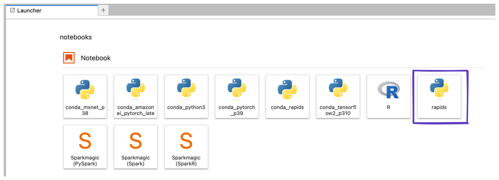

# Azure Machine Learning (Azure ML)

RAPIDS can be deployed at scale using Azure Machine Learning Service and easily scales up to any size needed. You can configure your environment on a local computer, Azure Machine Learning notebook service via compute instance or cluster.

## Pre-requisites

[Azure Machine Learning workspace](https://learn.microsoft.com/en-us/azure/machine-learning/concept-workspace). Use existing or create new workspace through the [Azure portal](https://learn.microsoft.com/en-us/azure/machine-learning/how-to-manage-workspace?tabs=azure-portal#create-a-workspace), [Azure ML Python SDK](https://learn.microsoft.com/en-us/azure/machine-learning/how-to-manage-workspace?tabs=python#create-a-workspace),[Azure CLI](https://learn.microsoft.com/en-us/azure/machine-learning/how-to-manage-workspace-cli?tabs=createnewresources) or [Azure Resource Manager templates](https://learn.microsoft.com/en-us/azure/machine-learning/how-to-create-workspace-template?tabs=azcli).Follow these quick steps to get started:

**1. Create.** Create your Azure Resource Group.

**2. Workspace.** Within the Resource Group, create an Azure Machine Learning service Workspace.

**3. Config.** Within the Workspace, download the `config.json` file and verify that `subscription_id`, `resource_group`, and `workspace_name` are set correctly for your environment.

**4. Quota.** Within your Workspace, check your Usage + Quota to ensure you have enough quota to launch your desired cluster size.

## Azure ML Compute instance (single or multi node)

Azure's [Compute instance](https://learn.microsoft.com/en-us/azure/machine-learning/concept-compute-instance) is a fully managed and secure development environment that can also serve as compute target for ML training and inferencing purposes. It comes with integrated Jupyter notebook server, JupyterLab, AzureML Python SDK and other tools.

### Select your instance

Sign in to Azure Machine Learning Studio and navigate to your workspace. On the left side, select Compute > +New > select a [RAPIDS compatible GPU](https://medium.com/dropout-analytics/which-gpus-work-with-rapids-ai-f562ef29c75f) (NVIDIA Pascal or greater with compute capability 6.0+) as the SageMaker Notebook instance type (e.g., ``).


### Provision RAPIDS setup script

Create a new "startup script" (via the 'Advanced Settings' dropdown). You can upload the script from your `Notebooks` files or local computer.
Optional to enable SSH access to your compute (if needed)


Check out this [link](https://learn.microsoft.com/en-us/azure/machine-learning/how-to-customize-compute-instance) for more details on how to create the setup script. which should, resemble this:

```bash
#!/bin/bash

set -e

sudo -u azureuser -i <<'EOF'

mamba create -y -n rapids {{ rapids_conda_channels }} {{ rapids_conda_packages }} ipykernel
conda activate rapids

# optionally install AutoGluon for AutoML GPU demo
# python -m pip install --pre autogluon

python -m ipykernel install --user --name rapids
echo "kernel install completed"
EOF
```

Launch the instance.

### Select the RAPIDS environment

Once your Notebook Instance is `InService` select "Open JupyterLab"

Then in Jupyter select the `rapids` kernel when working with a new notebook.



```{relatedexamples}

```
