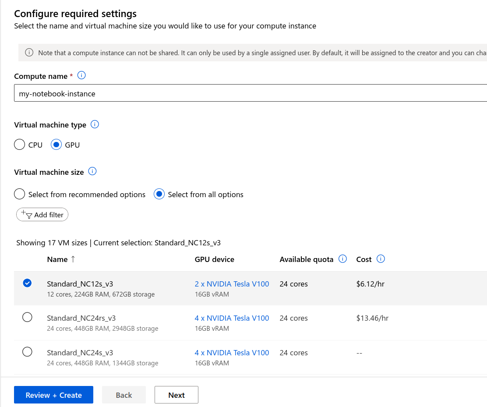
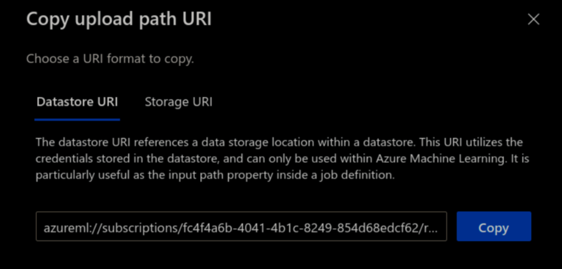

# Azure Machine Learning

RAPIDS can be deployed at scale using [Azure Machine Learning Service](https://learn.microsoft.com/en-us/azure/machine-learning/overview-what-is-azure-machine-learning) and easily scales up to any size needed.

## Pre-requisites

Use existing or create new Azure Machine Learning workspace through the [Azure portal](https://learn.microsoft.com/en-us/azure/machine-learning/how-to-manage-workspace?tabs=azure-portal#create-a-workspace), [Azure ML Python SDK](https://learn.microsoft.com/en-us/azure/machine-learning/how-to-manage-workspace?tabs=python#create-a-workspace), [Azure CLI](https://learn.microsoft.com/en-us/azure/machine-learning/how-to-manage-workspace-cli?tabs=createnewresources) or [Azure Resource Manager templates](https://learn.microsoft.com/en-us/azure/machine-learning/how-to-create-workspace-template?tabs=azcli).

Follow these high-level steps to get started:

**1. Create.** Create your Azure Resource Group.

**2. Workspace.** Within the Resource Group, create an Azure Machine Learning service Workspace.

**3. Config.** Within the Workspace, download the `config.json` file, as you will load the details to initialize workspace for running ML training jobs from within your notebook.


**4. Quota.** Check your Usage + Quota to ensure you have enough quota within your region to launch your desired cluster size.

## Azure ML Compute instance

Although it is possible to install Azure Machine Learning on your local computer, it is recommended to utilize [Azure's ML Compute instances](https://learn.microsoft.com/en-us/azure/machine-learning/concept-compute-instance), fully managed and secure development environments that can also serve as a [compute target](https://learn.microsoft.com/en-us/azure/machine-learning/concept-compute-target?view=azureml-api-2) for ML training.

The compute instance provides an integrated Jupyter notebook service, JupyterLab, Azure ML Python SDK, CLI, and other essential [tools](https://learn.microsoft.com/en-us/azure/machine-learning/concept-compute-target?view=azureml-api-2).

### Select your instance

Sign in to [Azure Machine Learning Studio](https://ml.azure.com/) and navigate to your workspace on the left-side menu.

Select **Compute** > **+ New** > choose a [RAPIDS compatible GPU](https://medium.com/dropout-analytics/which-gpus-work-with-rapids-ai-f562ef29c75f) VM size (e.g., `Standard_NC12s_v3`)



### Provision RAPIDS setup script

Navigate to the **Applications** section and choose "Provision with a startup script" to install RAPIDS and dependencies. You can upload the script from your Notebooks files or local computer.

Optional to enable SSH access to your compute (if needed).


Refer to [Azure ML documentation](https://learn.microsoft.com/en-us/azure/machine-learning/how-to-customize-compute-instance) for more details on how to create the setup script but it should resemble:

```bash
#!/bin/bash

sudo -u azureuser -i <<'EOF'

conda create -y -n rapids {{ rapids_conda_channels }} {{ rapids_conda_packages }} ipykernel
conda activate rapids

# install Python SDK v2 in rapids env
python -m pip install azure-ai-ml azure-identity

# optionally install AutoGluon for AutoML GPU demo
# python -m pip install --pre autogluon

python -m ipykernel install --user --name rapids
echo "kernel install completed"
EOF
```

Launch the instance.

### Select the RAPIDS environment

Once your Notebook Instance is `Running`, open "JupyterLab" and select the `rapids` kernel when working with a new notebook.

## Azure ML Compute cluster

Launch Azure's [ML Compute cluster](https://learn.microsoft.com/en-us/azure/machine-learning/how-to-create-attach-compute-cluster?tabs=python) to distribute your RAPIDS training jobs across a cluster of single or multi-GPU compute nodes.

The Compute cluster scales up automatically when a job is submitted, and executes in a containerized environment, packaging your model dependencies in a Docker container.

### Instantiate workspace

If using the Python SDK, connect to your workspace either by explicitly providing the workspace details or load from the `config.json` file downloaded in the pre-requisites section.

```python
from azure.ai.ml import MLClient
from azure.identity import DefaultAzureCredential

# Get a handle to the workspace
ml_client = MLClient(
    credential=DefaultAzureCredential(),
    subscription_id="<SUBSCRIPTION_ID>",
    resource_group_name="<RESOURCE_GROUP>",
    workspace_name="<AML_WORKSPACE_NAME>",
)

# or load details from config file
ml_client = MLClient.from_config(
    credential=DefaultAzureCredential(),
    path="config.json",
)
```

### Create AMLCompute

You will need to create a [compute target](https://learn.microsoft.com/en-us/azure/machine-learning/concept-compute-target?view=azureml-api-2#azure-machine-learning-compute-managed) using Azure ML managed compute ([AmlCompute](https://azuresdkdocs.blob.core.windows.net/$web/python/azure-ai-ml/0.1.0b4/azure.ai.ml.entities.html)) for remote training. Note: Be sure to check limits within your available region. This [article](https://learn.microsoft.com/en-us/azure/machine-learning/how-to-manage-quotas?view=azureml-api-2#azure-machine-learning-compute) includes details on the default limits and how to request more quota.

[**size**]: The VM family of the nodes.
Specify from one of **NC_v2**, **NC_v3**, **ND** or **ND_v2** GPU virtual machines (e.g `Standard_NC12s_v3`)

[**max_instances**]: The max number of nodes to autoscale up to when you run a job

```{note}
You may choose to use low-priority VMs to run your workloads. These VMs don't have guaranteed availability but allow you to take advantage of Azure's unused capacity at a significant cost savings. The amount of available capacity can vary based on size, region, time of day, and more.
```

```python
from azure.ai.ml.entities import AmlCompute

gpu_compute = AmlCompute(
    name="rapids-cluster",
    type="amlcompute",
    size="Standard_NC12s_v3",
    max_instances=3,
    idle_time_before_scale_down=300,  # Seconds of idle time before scaling down
    tier="low_priority",  # optional
)
ml_client.begin_create_or_update(gpu_compute).result()
```

### Access Datastore URI

A [datastore URI](https://learn.microsoft.com/en-us/azure/machine-learning/how-to-access-data-interactive?tabs=adls&view=azureml-api-2#access-data-from-a-datastore-uri-like-a-filesystem-preview) is a reference to a blob storage location (path) on your Azure account. You can copy-and-paste the datastore URI from the AzureML Studio UI:

1. Select **Data** from the left-hand menu > **Datastores** > choose your datastore name > **Browse**
2. Find the file/folder containing your dataset and click the elipsis (...) next to it.
3. From the menu, choose **Copy URI** and select **Datastore URI** format to copy into your notebook.



### Custom RAPIDS Environment

To run an AzureML experiment, you must specify an [environment](https://learn.microsoft.com/en-us/azure/machine-learning/concept-environments?view=azureml-api-2) that contains all the necessary software dependencies to run the training script on distributed nodes. <br>
You can define an environment from a [pre-built](https://learn.microsoft.com/en-us/azure/machine-learning/how-to-manage-environments-v2?tabs=python&view=azureml-api-2#create-an-environment-from-a-docker-image) docker image or create-your-own from a [Dockerfile](https://learn.microsoft.com/en-us/azure/machine-learning/how-to-manage-environments-v2?tabs=python&view=azureml-api-2#create-an-environment-from-a-docker-build-context) or [conda](https://learn.microsoft.com/en-us/azure/machine-learning/how-to-manage-environments-v2?tabs=python&view=azureml-api-2#create-an-environment-from-a-conda-specification) specification file.

Create your custom RAPIDS docker image using the example below, making sure to install additional packages needed for your workflows.

```dockerfile

# Use latest rapids image with the necessary dependencies
FROM {{ rapids_container }}

# Update and/or  install required packages
RUN apt-get update && \
    apt-get install -y --no-install-recommends build-essential fuse && \
    rm -rf /var/lib/apt/lists/*

# Activate rapids conda environment
RUN /bin/bash -c "source activate rapids && pip install azureml-mlflow"
```

Now create the Environment, making sure to label and provide a description:

```python
from azure.ai.ml.entities import Environment, BuildContext

env_docker_image = Environment(
    build=BuildContext(path="Dockerfile"),
    name="rapids-mlflow",
    description="RAPIDS environment with azureml-mlflow",
)

ml_client.environments.create_or_update(env_docker_image)
```

### Submit RAPIDS Training jobs

Now that we have our environment and custom logic, we can configure and run the `command` [class](https://learn.microsoft.com/en-us/python/api/azure-ai-ml/azure.ai.ml?view=azure-python#azure-ai-ml-command) to submit training jobs. `inputs` is a dictionary of command-line arguments to pass to the training script.

```python
from azure.ai.ml import command, Input
from azure.ai.ml.sweep import Choice, Uniform

command_job = command(
    environment="rapids-mlflow:1",  # specify version of environment to use
    experiment_name="test_rapids_mlflow",
    code=project_folder,
    command="python train_rapids.py --data_dir ${{inputs.data_dir}} \
                    --n_bins ${{inputs.n_bins}} \
                    --cv_folds ${{inputs.cv_folds}} \
                    --n_estimators ${{inputs.n_estimators}} \
                    --max_depth ${{inputs.max_depth}} \
                    --max_features ${{inputs.max_features}}",
    inputs={
        "data_dir": Input(type="uri_file", path=data_uri),
        "n_bins": 32,
        "cv_folds": 5,
        "n_estimators": 50,
        "max_depth": 10,
        "max_features": 1.0,
    },
    compute="rapids-cluster",
)

returned_job = ml_client.jobs.create_or_update(command_job)  # submit training job


# define hyperparameter space to sweep over
command_job_for_sweep = command_job(
    n_estimators=Choice(values=range(50, 500)),
    max_depth=Choice(values=range(5, 19)),
    max_features=Uniform(min_value=0.2, max_value=1.0),
)

# apply hyperparameter sweep_job
sweep_job = command_job_for_sweep.sweep(
    compute="rapids-cluster",
    sampling_algorithm="random",
    primary_metric="Accuracy",
    goal="Maximize",
)

returned_sweep_job = ml_client.create_or_update(sweep_job)  # submit hpo job
```

### CleanUp

```python
# Delete compute cluster
ml_client.compute.begin_delete(gpu_compute.name).wait()
```

```{relatedexamples}

```
