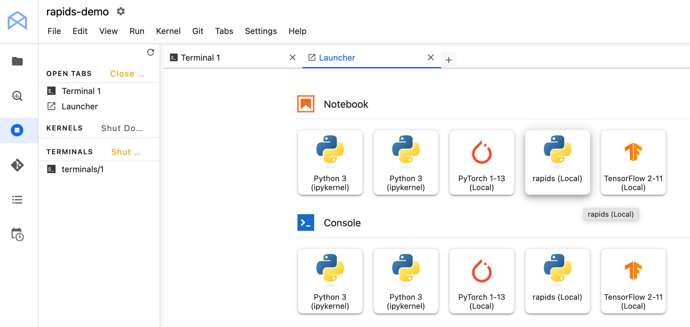

# Vertex AI

RAPIDS can be deployed on [Vertex AI Workbench](https://cloud.google.com/vertex-ai-workbench).

## Create a new Notebook Instance

1. From the Google Cloud UI, navigate to [**Vertex AI**](https://console.cloud.google.com/vertex-ai/workbench/user-managed) -> Notebook -> **Workbench**
2. Select **Instances** and select **+ CREATE NEW**.
3. In the **Details** section give the instance a name.
4. Check the "Attach 1 NVIDIA T4 GPU" option.
5. After customizing any other aspects of the machine you wish, click **CREATE**.

```{tip}
If you want to select a different GPU or select other hardware options you can select "Advanced Options" at the bottom and then make changes in the "Machine type" section.
```

## Install RAPIDS

Once the instance has started select **OPEN JUPYTER LAB** and at the top of a notebook install the RAPIDS libraries you wish to use.

```{warning}
Installing RAPIDS via `pip` in the default environment is [not currently possible](https://github.com/rapidsai/deployment/issues/517), for now you must create a new `conda` environment.

Vertex AI currently ships with CUDA Toolkit 11 system packages as of the [Jan 2025 Vertex AI release](https://cloud.google.com/vertex-ai/docs/release-notes#January_31_2025).
The default Python environment also contains the `cupy-cuda12x` package. This means it's not possible to install RAPIDS package like `cudf` via `pip` as `cudf-cu12` will conflict with the CUDA Toolkit version but `cudf-cu11` will conflict with the `cupy` version.

You can find out your current system CUDA Toolkit version by running `ls -ld /usr/local/cuda*`.
```

You can create a new RAPIDS conda environment and register it with `ipykernel` for use in Jupyter Lab. Open a new terminal in Jupyter and run the following commands.

```bash
# Create a new environment
$ conda create -y -n rapids \
    {{ rapids_conda_channels }} \
    {{ rapids_conda_packages }} \
    ipykernel
```

```bash
# Activate the environment
$ conda activate rapids
```

```bash
# Register the environment with Jupyter
$ python -m ipykernel install --prefix "${DL_ANACONDA_HOME}/envs/rapids" --name rapids --display-name rapids
```

Then refresh the Jupyter Lab page and open the launcher. You will see a new "rapids" kernel available.



```{tip}
If you don't see the new kernel wait a minute and refresh the page again, it can take a little while to show up.
```

## Test RAPIDS

You should now be able to open a notebook and use RAPIDS.

For example we could import and use RAPIDS libraries like `cudf`.

```ipython
In [1]: import cudf
In [2]: df = cudf.datasets.timeseries()
In [3]: df.head()
Out[3]:
                       id     name         x         y
timestamp
2000-01-01 00:00:00  1020    Kevin  0.091536  0.664482
2000-01-01 00:00:01   974    Frank  0.683788 -0.467281
2000-01-01 00:00:02  1000  Charlie  0.419740 -0.796866
2000-01-01 00:00:03  1019    Edith  0.488411  0.731661
2000-01-01 00:00:04   998    Quinn  0.651381 -0.525398
```

```{relatedexamples}

```
