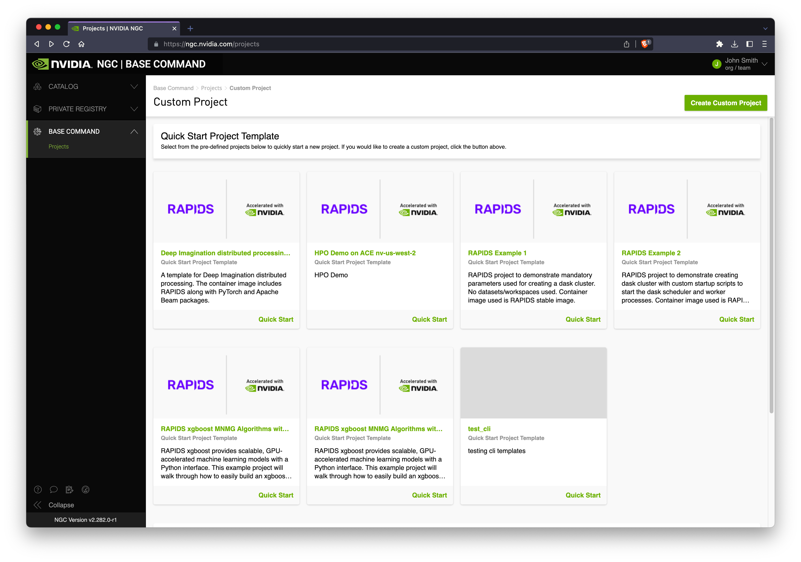
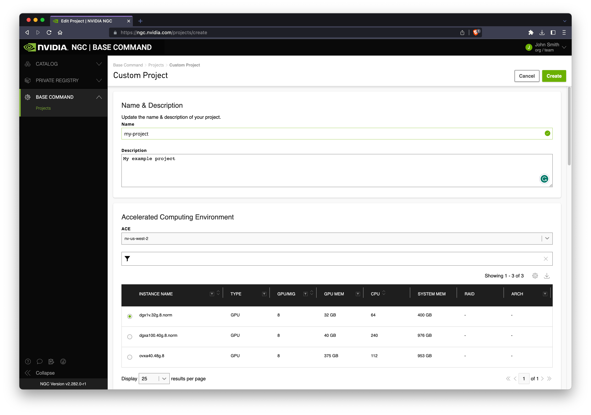
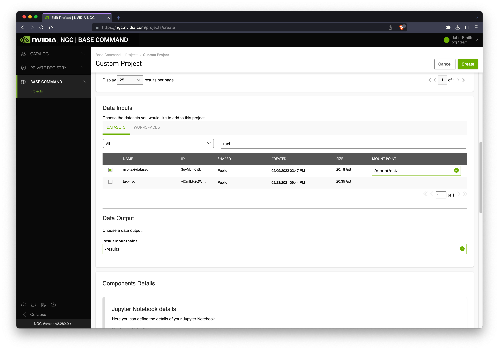
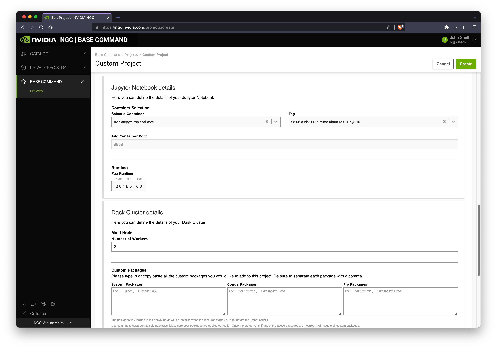
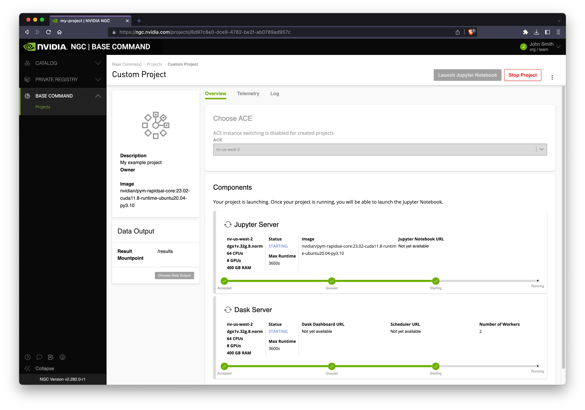
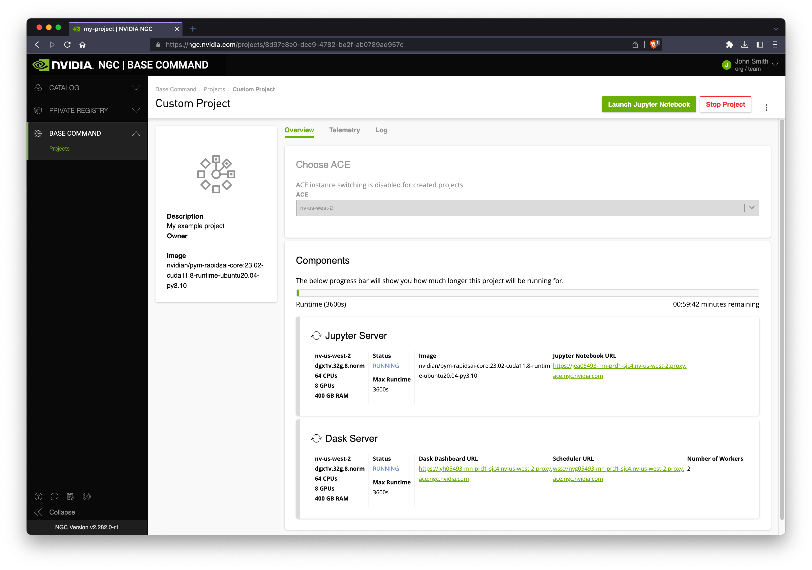
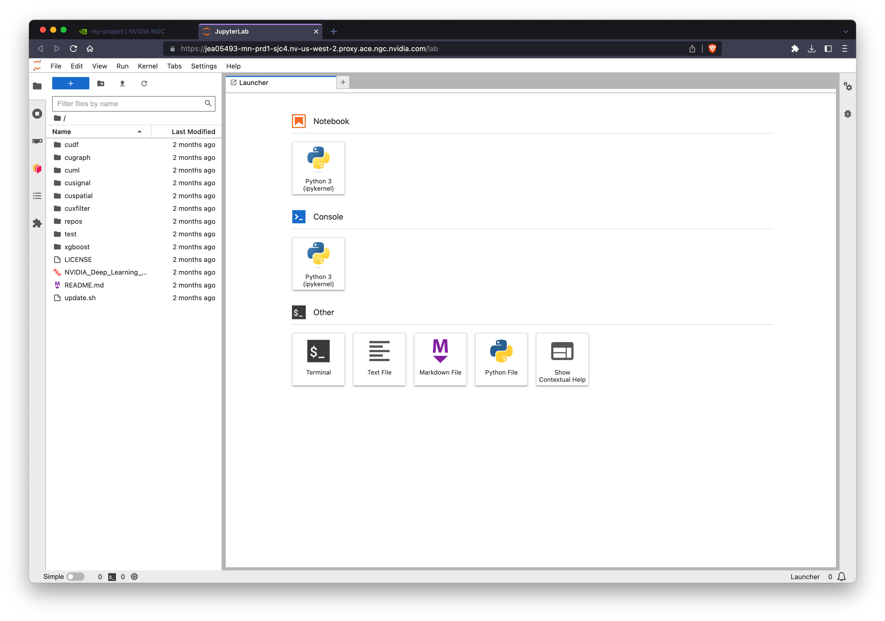
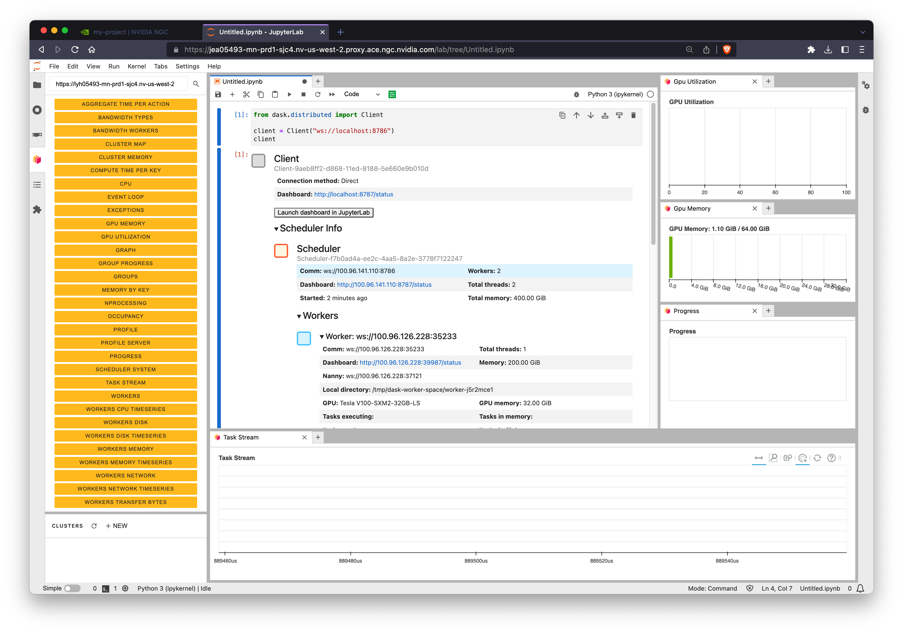
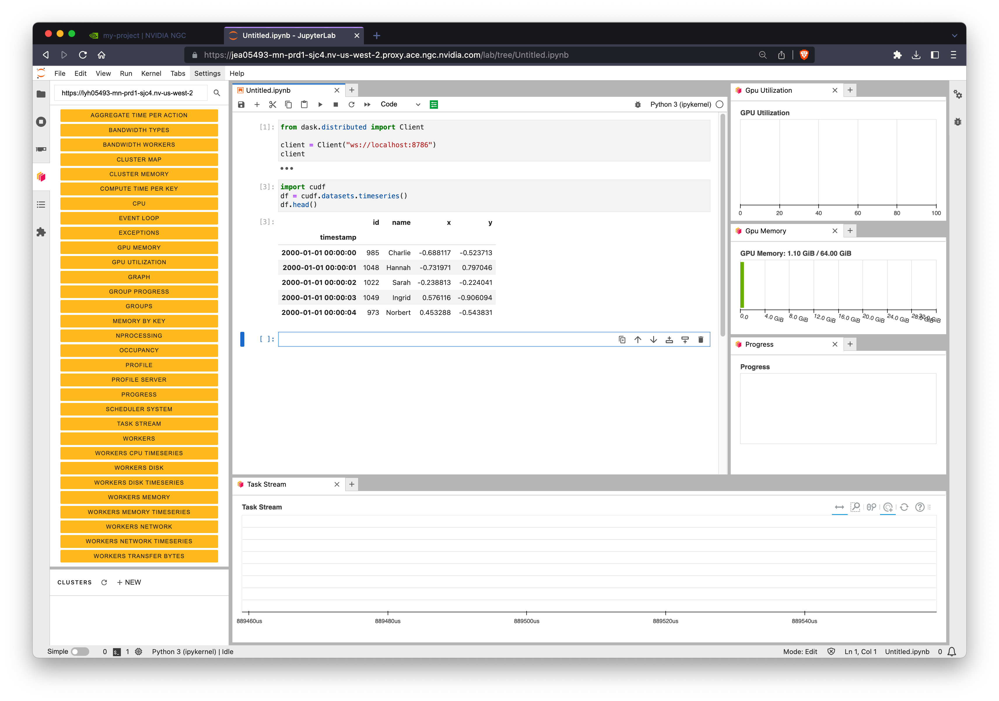

# NVIDIA DGX Cloud (Base Command Platform)

[NVIDIA Base Command™ Platform (BCP)](https://www.nvidia.com/en-gb/data-center/base-command-platform/) is a software service in [NVIDIA DGX Cloud](https://www.nvidia.com/en-us/data-center/dgx-cloud/) for enterprise-class AI training that enables businesses and their data scientists to accelerate AI development.

In addition to launching batch training jobs BCP also allows you to quickly launch RAPIDS clusters running Jupyter and Dask.

## Prerequisites

To get started sign up for a [DGX Cloud account](https://www.nvidia.com/en-us/data-center/dgx-cloud/trial/).

## Launch a cluster

Login to [NVIDIA NGC](https://www.nvidia.com/en-gb/gpu-cloud/) and navigate to the [BCP service](https://ngc.nvidia.com/projects).

Select "Create Custom Project" (alternatively select a quick start project then select the three dots in the top-right to open a menu and select edit project).



Next give your project a title and description and choose an _Accelerated Computing Environment (ACE)_ and an _Instance Type_.



Scroll down and select your mount points:

- **Datasets** are existing data you have stored in NGC which you would like to mount to your cluster.
- **Workspaces** are persistent storage where you may wish to keep notebooks and other working data.
- **Results** is a required mount point where you will write your output results (if any).



Scroll down and select the latest RAPIDS container image.



```{note}
Optionally configure your desired number of Dask workers, session wall time and any additional packages you wish to install at runtime.
```

When you are ready hit **Create**.

## Accessing Jupyter

Once you create your cluster it will go into a _Queued_ or _Starting_ state. Behind the scenes NVIDIA DGX Cloud will provision infrastructure either in NVIDIA data centers or in the cloud depending on your ACE selection.



Once your cluster is running you will see various URLs to choose from:

- **Jupyter** launches [Jupyter Lab](https://jupyter.org/) running on the scheduler node.
- **Dask Dashboard** opens the [Dask Dashboard](https://docs.dask.org/en/stable/dashboard.html) in a new tab.
- **Scheduler URL** can be used to connect a Dask client from outside of BCP.



Let's click the **Jupyter** link and use RAPIDS from a notebook environment.



## Connecting a Dask client

The Dask scheduler is running on the same node as Jupyter so you can connect a `dask.distributed.Client` to `ws://localhost:8786`.

```{warning}
BCP configures Dask to use websockets instead of the default TCP to allow for proxying ourside of NGC. So all connection urls will start with `ws://`.
```



```{note}
You can also copy/paste the Dask dashboard URL we saw earlier into the Dask Jupyter extension to view cluster metrics right within Jupyter.
```

## Testing RAPIDS

Now that we're all set up with a Jupyter session and have connected to our Dask cluster we can import `cudf` to verify we can use RAPIDS.



For more detailed examples see our related notebooks.

```{relatedexamples}

```
