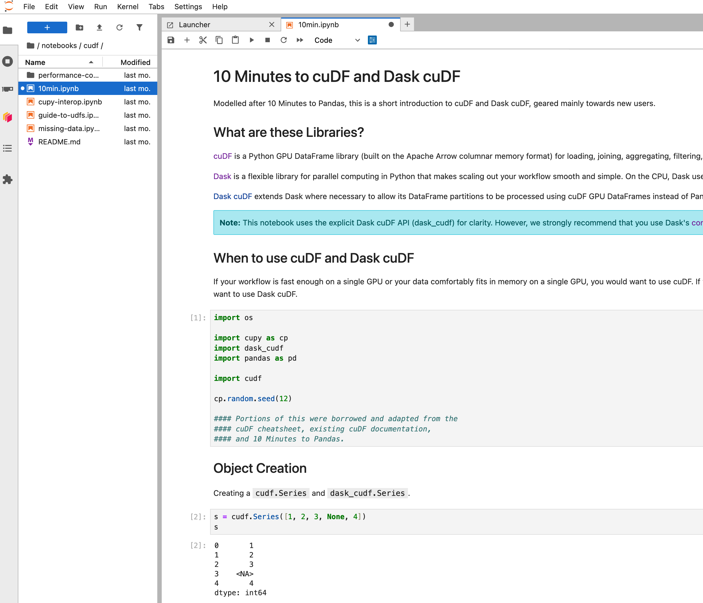
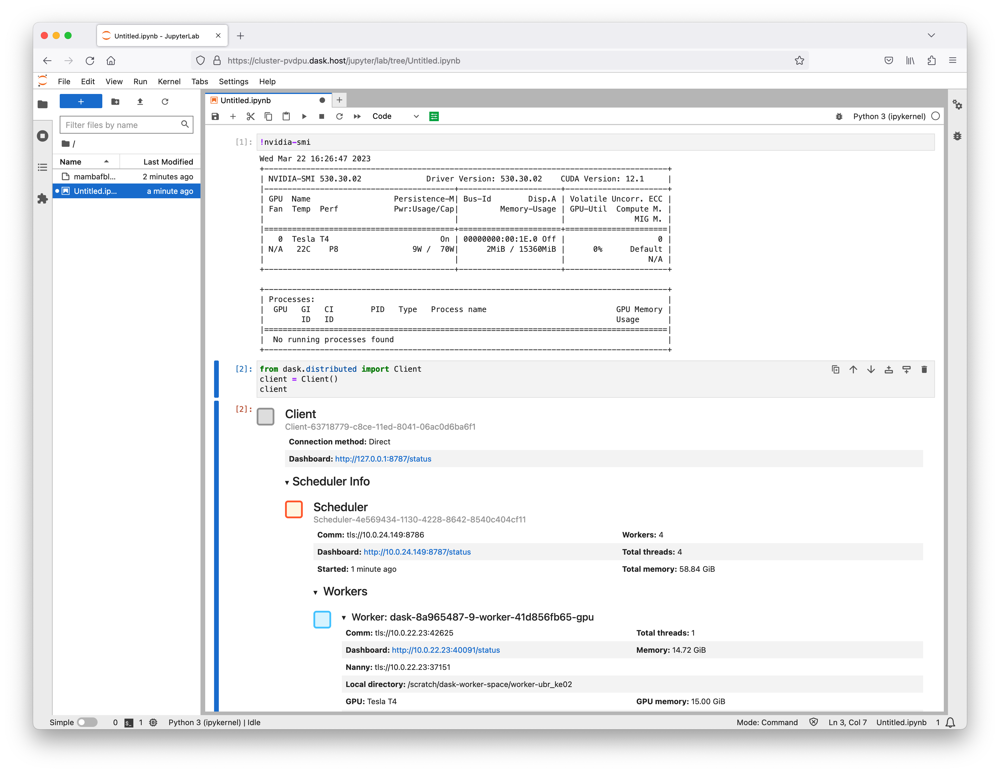

# Coiled

You can deploy RAPIDS on cloud VMs with GPUs using [Coiled](https://www.coiled.io/).
Coiled is a software platform that manages Cloud VMs on your behalf.
It manages software environments and can launch Python scripts, Jupyter Notebook servers, Dask clusters or even just individual Python functions.
Remote machines are booted just in time and shut down when not in use or idle.

By using the [`coiled`](https://anaconda.org/conda-forge/coiled) Python library, you can setup and manage Dask clusters with GPUs and RAPIDs on cloud computing environments such as GCP or AWS.

## Setup

Head over to [Coiled](https://docs.coiled.io/user_guide/setup/index) and register for an account.

Once your account is set up, install the coiled Python library/CLI tool.

```bash
pip install coiled
```

Then you can authenticate with your Coiled account.

```bash
coiled login
```

For more information see the [Coiled Getting Started documentation](https://docs.coiled.io/user_guide/setup/index).

## Notebook Quickstart

The simplest way to get up and running with RAPIDS on Coiled is to launch a Jupyter notebook server using the RAPIDS notebook container.

```bash
coiled notebook start --gpu --container {{ rapids_notebooks_container }}
```



## Software Environments

By default when running remote operations Coiled will [attempt to create a copy of your local software environment](https://docs.coiled.io/user_guide/software/sync.html) which can be loaded onto the remote VMs. While this is an excellent feature it's likely that you do not have all of the GPU software libraries you wish to use installed locally. In this case we need to tell Coiled which software environment to use.

### Container images

All Coiled commands can be passed a container image to use. This container will be pulled onto the remote VM at launch time.

```bash
coiled notebook start --gpu --container {{ rapids_notebooks_container }}
```

This is often the most convenient way to try out existing software environments, but is often not the most performant due to the way container images are unpacked.

### Coiled Software Environments

You can also created Coiled software environments ahead of time. These environments are built and cached on the cloud and can be pulled onto new VMs very quickly.

You can create a RAPIDS software environment using a conda `environment.yaml` file or a pip `requirements.txt` file.

#### Conda example

Create an environment file containing the RAPIDS packages

```yaml
# rapids-environment.yaml
name: rapidsai-notebooks
channels:
  - rapidsai
  - conda-forge
  - nvidia
dependencies:
  # RAPIDS packages
  - rapids={{ rapids_version }}
  - python=3.12
  - cuda-version>=12.0,<=12.5
  # (optional) Jupyter packages, necessary for Coiled Notebooks and Dask clusters with Jupyter enabled
  - jupyterlab
  - jupyterlab-nvdashboard
  - dask-labextension
```

```bash
coiled env create --name rapids --gpu-enabled --conda rapids-environment.yaml
```

Then you can specify this software environment when starting new Coiled resources.

```bash
coiled notebook start --gpu --software rapidsai-notebooks
```

## CLI Jobs

You can execute a script in a container on an ephemeral VM with [Coiled CLI Jobs](https://docs.coiled.io/user_guide/cli-jobs.html).

```bash
coiled run python my_code.py  # Boots a VM on the cloud, runs the scripts, then shuts down again
```

We can use this to run GPU code on a remote environment using the RAPIDS container. You can set the coiled CLI to keep the VM around for a few minutes after execution is complete just in case you want to run it again and reuse the same hardware.

```concole
$ coiled run --gpu --name rapids-demo --keepalive 5m --container {{ rapids_container }} -- python my_code.py
...
```

This works very nicely when paired with the cudf.pandas CLI tool. For example we can run `python -m cudf.pandas my_script` to GPU accelerate our Pandas code without having to rewrite anything. For example [this script](https://gist.github.com/jacobtomlinson/2481ecf2e1d2787ae2864a6712eef97b#file-cudf_pandas_coiled_demo-py) processes some open NYC parking data. With `pandas` it takes around a minute, but with `cudf.pandas` it only takes a few seconds.

```console
$ coiled run --gpu --name rapids-demo --keepalive 5m --container {{ rapids_container }} -- python -m cudf.pandas cudf_pandas_coiled_demo.py

Output
------

This container image and its contents are governed by the NVIDIA Deep Learning Container License.
By pulling and using the container, you accept the terms and conditions of this license:
https://developer.download.nvidia.com/licenses/NVIDIA_Deep_Learning_Container_License.pdf

Calculate violations by state took: 3.470 seconds
Calculate violations by vehicle type took: 0.145 seconds
Calculate violations by day of week took: 1.238 seconds
```

## Notebooks

To start an interactive Jupyter notebook session with [Coiled Notebooks](https://docs.coiled.io/user_guide/notebooks.html) run the RAPIDS notebook container via the notebook service.

```bash
coiled notebook start --gpu --container {{ rapids_notebooks_container }}
```

Note that the `--gpu` flag will automatically select a `g4dn.xlarge` instance with a T4 GPU on AWS. You could additionally add the `--vm-type` flag to explicitly choose another machine type with different GPU configuration. For example to choose a machine with 4 L4 GPUs you would run the following.

```bash
coiled notebook start --gpu --vm-type g6.24xlarge --container nvcr.io/nvidia/rapidsai/notebooks:24.12-cuda12.5-py3.12
```

## Dask Clusters

Coiled’s [managed Dask clusters](https://docs.coiled.io/user_guide/dask.html) can also provision clusters using [dask-cuda](https://docs.rapids.ai/api/dask-cuda/nightly/) to enable using RAPIDS in a distributed way.

```python
cluster = coiled.Cluster(
    container="{{ rapids_notebooks_container }}",  # specify the software env to use
    jupyter=True,  # run Jupyter server on scheduler
    scheduler_gpu=True,  # add GPU to scheduler
    n_workers=4,
    worker_gpu=1,  # single T4 per worker
    worker_class="dask_cuda.CUDAWorker",  # recommended
)
```

Once the cluster has started you can also get the Jupyter URL and navigate to Jupyter Lab running on the Dask Scheduler node.

```python
>>> print(cluster.jupyter_link)
https://cluster-abc123.dask.host/jupyter/lab?token=dddeeefff444555666
```

We can run `!nvidia-smi` in our notebook to see information on the GPU available to Jupyter.

We can also connect a Dask client to see that information for the workers too.

```python
from dask.distributed import Client

client = Client()
client
```



From this Jupyter session we can see that our notebook server has a GPU and we can connect to the Dask cluster with no configuration and see all the Dask Workers have GPUs too.

```{relatedexamples}

```
