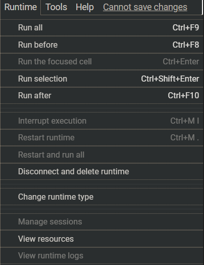
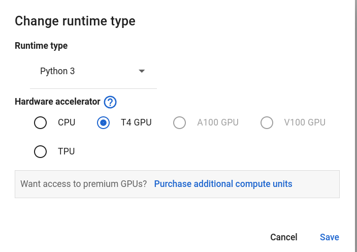
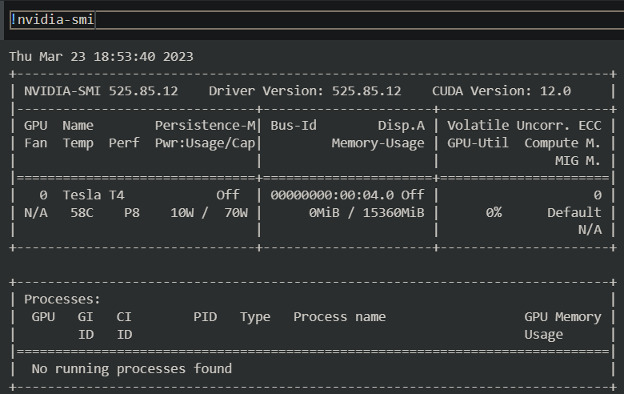

# NVIDIA CUDA-X Libraries for Data Science on Google Colab

## Overview

cuDF is preinstalled on Google Colab and instantly accelerates Pandas with zero code changes. [You can quickly get started with our tutorial notebook](https://nvda.ws/rapids-cudf). This guide is applicable for users who want to use the full suite of NVIDIA CUDA-X libraries for Data Science in their workflows. It is broken into two sections:

1. [Quick Install](colab-quick) - applicable for most users and quickly installs all the stable packages.
2. [Custom Setup Instructions](colab-custom) - step-by-step setup instructions covering the **must haves** for when users need to adapt an instance to their workflows.

In both sections, we will be installing the libraries on Colab using pip. The pip installation allows users to install libraries like cuDF, cuML, and cuGraph stable versions in a few minutes.

The Colab installation strives to be an "always working" solution, and sometimes will **pin** package versions to ensure compatibility.

(colab-quick)=

## Section 1: Quick Install

### Links

Please follow the links below to our install templates:

#### Pip

1. Open the pip template link by clicking this button -->
   <a target="_blank" href="https://colab.research.google.com/github/rapidsai-community/rapidsai-csp-utils/blob/main/test/test_colab_update.ipynb">
   
   </a> .
1. Click **Runtime** > **Run All**.
1. Wait a few minutes for the installation to complete without errors.
1. Add your code in the cells below the template.

(colab-custom)=

## Section 2: User-Customizable Install Instructions

### 1. Launch notebook

To get started in [Google Colab](https://colab.research.google.com/), click `File` at the top toolbar to Create new or Upload existing notebook

### 2. Set the Runtime

Click the `Runtime` dropdown and select `Change Runtime Type`



Choose GPU for Hardware Accelerator



### 3. Check GPU type

Check the output of `!nvidia-smi` to make sure you've been allocated a compatible GPU ([see the system requirements](https://docs.nvidia.com/datascience/install/#system-req)).



### 4. Install the libraries on Colab

You can install the libraries using pip. The script first checks GPU compatibility, then installs the latest **stable** versions of some core libraries (e.g. cuDF, cuML, cuGraph, and xgboost) using `pip`.

```bash
# Colab warns and provides remediation steps if the GPUs is not compatible with RAPIDS.

!git clone https://github.com/rapidsai/rapidsai-csp-utils.git
!python rapidsai-csp-utils/colab/pip-install.py
```

### 5. Verify the installation

Run the following in a Python cell.

```python
import cudf

gdf = cudf.DataFrame({"a": [1, 2, 3], "b": [4, 5, 6]})
gdf
```

The output should be

```python
    a   b
0   1   4
1   2   5
2   3   6
```

### 6. Next steps

Try a more thorough example of using cuDF on Google Colab, the cuDF pandas accelerator mode tutorial ([Google Colab link](https://nvda.ws/rapids-cudf)).
