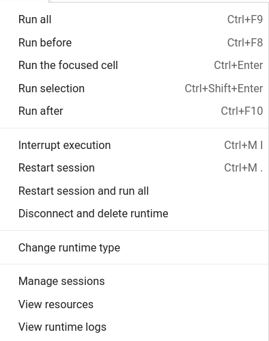

# RAPIDS on Google Colab

## Overview

This guide is broken into two sections:

1. [RAPIDS Quick Install](colab-quick) - applicable for most users
2. [RAPIDS Custom Setup Instructions](colab-custom) - step by step set up instructions covering the **must haves** for when a user needs to adapt instance to their workflows

In both sections, will be installing RAPIDS on colab using pip or conda. Here are the differences between the two installation methods

- Pip installation allows users to install cuDF, cuML, cuGraph, and cuSpatial stable versions in a few minutes (1/5 ease of install)
- Conda installation installs the complete, customized RAPIDS library package (such as installing stable or nightly) however, it can take around 15 minutes to install and has a couple of break points requiring the user to manually continue the installation (2/5 ease of install)

RAPIDS install on Colab strives to be an "always working" solution, and sometimes will **pin** RAPIDS versions to ensure compatiblity.

(colab-quick)=

## Section 1: RAPIDS Quick Install

### Links

Please follow the links below to our install templates:

#### Pip

1. Open the pip template link by clicking this button -->
   <a target="_blank" href="https://colab.research.google.com/drive/13sspqiEZwso4NYTbsflpPyNFaVAAxUgr">
   
   </a> .
1. Click **Runtime** > **Run All**.
1. Wait a few minutes for the installation to complete without errors.
1. Add your code in the cells below the template.

#### Conda

1. Open the conda template link by clicking this button -->
   <a target="_blank" href="https://colab.research.google.com/drive/1TAAi_szMfWqRfHVfjGSqnGVLr_ztzUM9">
   
   </a> . There are instructions in the notebook and below. Default to the Notebook's instructions if they deviate, as below is for reference and additional context.
1. Click **Runtime** > **Run All**. This will NOT run all cells as the installation will pause after updating Colab's gcc. Ignore all Colab alerts.
1. Go to the next unrun cell and run it to install conda. The installation will pause again. Ignore all Colab alerts.
1. Run the test and conda install test cell.
1. Before running the RAPIDS install cell, you can change the installation type between `stable` and `nightly`. Leaving it blank or adding any other words will default to 'stable'. All disclaimers around nightly installs apply.
1. Run the rest of the cells to complete the installation of RAPIDS on Colab.
1. Add your code in the cells below the template.

(colab-custom)=

## Section 2: User Customizable RAPIDS Install Instructions

### 1. Launch notebook

To get started in [Google Colab](https://colab.research.google.com/), click `File` at the top toolbar to Create new or Upload existing notebook

### 2. Set the Runtime

Click the `Runtime` dropdown and select `Change Runtime Type`



Choose GPU for Hardware Accelerator


### 3. Check GPU type

Check the output of `!nvidia-smi` to make sure you've been allocated a Rapids Compatible GPU, i.e [Tesla T4, P4, or P100].


### 4. Install RAPIDS on Colab

You can install RAPIDS using

1. pip
1. conda

#### 4.1. Pip

Checks GPU compatibility with RAPIDS, then installs the latest **stable** versions of RAPIDSAI's core libraries (cuDF, cuML, cuGraph, and xgboost) using `pip`.

```bash
# Colab warns and provides remediation steps if the GPUs is not compatible with RAPIDS.

!git clone https://github.com/rapidsai/rapidsai-csp-utils.git
!python rapidsai-csp-utils/colab/pip-install.py
```

#### 4.2. Conda

If you need to install any RAPIDS Extended libraries or the nightly version, you can use the [RAPIDS Conda Colab Template](https://colab.research.google.com/drive/1TAAi_szMfWqRfHVfjGSqnGVLr_ztzUM9) notebook and install via `conda`.

1. Create and run a cell with the code below to update Colab's gcc. Ignore all Colab alerts.

```bash
!bash rapidsai-csp-utils/colab/update_gcc.sh
import os
os._exit(00)
```

1. Create and run a cell with the code below to install conda on Colab. Ignore all Colab alerts.

```bash
import condacolab
condacolab.install()
```

[Optional] Run the test and conda install test cell.

```bash
import condacolab
condacolab.check()
```

1. Before running the RAPIDS install cell, you can change the installation type between `stable` and `nightly`. All disclaimers around nightly installs apply.
1. Run the rest of the cells to complete the installation of RAPIDS on Colab.

```bash
!python rapidsai-csp-utils/colab/install_rapids.py stable # example runs stable
import os
os.environ['NUMBAPRO_NVVM'] = '/usr/local/cuda/nvvm/lib64/libnvvm.so'
os.environ['NUMBAPRO_LIBDEVICE'] = '/usr/local/cuda/nvvm/libdevice/'
os.environ['CONDA_PREFIX'] = '/usr/local'
```

### 5. Test Rapids

```python
import cudf

gdf = cudf.DataFrame({"a":[1,2,3],"b":[4,5,6]})
gdf
    a   b
0   1   4
1   2   5
2   3   6

```

### 6. Next steps

Check out this [guide](https://towardsdatascience.com/) for an overview of how to access and work with your own datasets in Colab.

For more RAPIDS examples, check out our RAPIDS [notebooks](https://github.com/rapidsai/notebooks) and [notebooks-contrib](https://github.com/rapidsai/notebooks-contrib) repos
