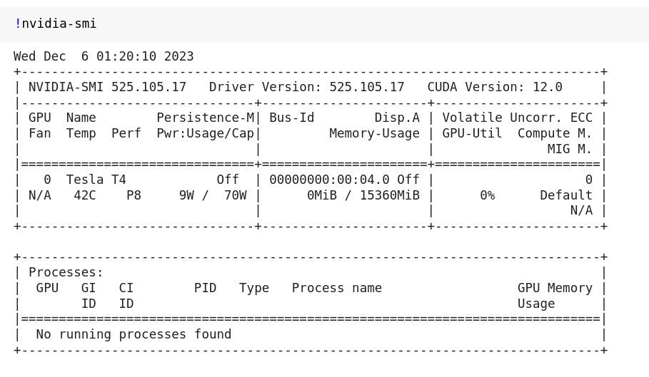

# RAPIDS on Google Colab

## Overview

RAPIDS cuDF is preinstalled on Google Colab and instantly accelerates Pandas with zero code changes. [You can quickly get started with our tutorial notebook](https://nvda.ws/rapids-cudf). This guide is applicable for users who want to utilize the full suite of the RAPIDS libraries for their workflows. It is broken into two sections:

1. [RAPIDS Quick Install](colab-quick) - applicable for most users and quickly installs all the RAPIDS Stable packages.
2. [RAPIDS Custom Setup Instructions](colab-custom) - step by step set up instructions covering the **must haves** for when a user needs to adapt instance to their workflows.

In both sections, we will be installing RAPIDS on colab using pip. The pip installation allows users to install cuDF, cuML, cuGraph, cuXfilter, and cuSpatial stable versions in a few minutes.

RAPIDS install on Colab strives to be an "always working" solution, and sometimes will **pin** RAPIDS versions to ensure compatiblity.

(colab-quick)=

## Section 1: RAPIDS Quick Install

### Links

Please follow the links below to our install templates:

#### Pip

1. Open the pip template link by clicking this button -->
   <a target="_blank" href="https://nvda.ws/3XEO6hK">
   
   </a> .
1. Click **Runtime** > **Run All**.
1. Wait a few minutes for the installation to complete without errors.
1. Add your code in the cells below the template.

(colab-custom)=

## Section 2: User Customizable RAPIDS Install Instructions

### 1. Launch notebook

To get started in [Google Colab](https://colab.research.google.com/), click `File` at the top toolbar to Create new or Upload existing notebook

### 2. Set the Runtime

Click the `Runtime` dropdown and select `Change Runtime Type`


Choose GPU for Hardware Accelerator


### 3. Check GPU type

Check the output of `!nvidia-smi` to make sure you've been allocated a Rapids Compatible GPU ([see the RAPIDS install docs](https://docs.rapids.ai/install/#system-req)).



### 4. Install RAPIDS on Colab

You can install RAPIDS using pip. The script first checks GPU compatibility with RAPIDS, then installs the latest **stable** versions of some core RAPIDS libraries (e.g. cuDF, cuML, cuGraph, and xgboost) using `pip`.

```bash
# Colab warns and provides remediation steps if the GPUs is not compatible with RAPIDS.

!git clone https://github.com/rapidsai/rapidsai-csp-utils.git
!python rapidsai-csp-utils/colab/pip-install.py
```

### 5. Test RAPIDS

Run the following in a Python cell.

```python
import cudf

gdf = cudf.DataFrame({"a":[1,2,3], "b":[4,5,6]})
gdf
    a   b
0   1   4
1   2   5
2   3   6

```

### 6. Next steps

Try a more thorough example of using cuDF on Google Colab, "10 Minutes to RAPIDS cuDF's pandas accelerator mode (cudf.pandas)" ([Google Colab link](https://nvda.ws/rapids-cudf)).
