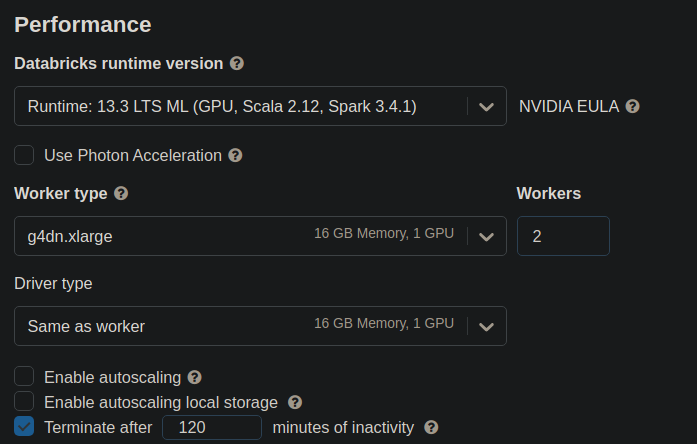

In order to launch a GPU node uncheck **Use Photon Acceleration**. Then choose Databricks ML GPU Runtime from the drop down. For instance,`13.3 LTS ML (GPU, Scala 2.12, Spark 3.4.1)`. Once you have done this you should be able to select one of the GPU-accelerated instance types for the Driver and Worker nodes.

Optional to enable autoscale for worker nodes based on load.



Expand the **Advanced Options** section and open the **Init Scripts** tab and add the file path to the init script starting with `/Users`.

You can also configure cluster log delivery, which will write the init script logs to DBFS in a subdirectory called `dbfs:/cluster-logs/<cluster-id>/init_scripts/`. Refer to [docs](https://docs.databricks.com/en/init-scripts/logs.html) for more information.

At the top of your notebook run any of the following `pip` install commands to install your preferred RAPIDS libraries.

```text
!pip install cudf-cu11 dask-cudf-cu11 --extra-index-url=https://pypi.nvidia.com
!pip install cuml-cu11 --extra-index-url=https://pypi.nvidia.com
!pip install cugraph-cu11 --extra-index-url=https://pypi.nvidia.com
```
