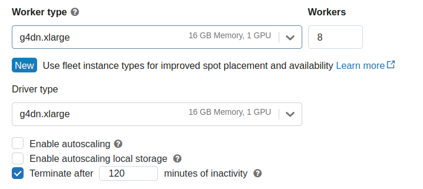

# Databricks

## DASK Rapids in Databricks MNMG Cluster

You can launch Dask RAPIDS cluster on a multi-node GPU Databricks cluster

```{warning}
It is also possible to use [Spark RAPIDS](https://docs.nvidia.com/spark-rapids/user-guide/latest/getting-started/databricks.html) with Dask on the same Databricks cluster. To do this, the user
must provide an init script that downloads the `rapids-4-spark-xxxx.jar`` plugin and then configure Spark to load this plugin.
```

### Init script

Before creating the cluster, we will need to create an [initialization script](https://docs.databricks.com/en/init-scripts/index.html) to install Dask and the RAPIDS Accelerator for Apache Spark.

Databricks recommends storing all cluster-scoped init scripts using workspace files. Each user has a Home directory configured under the `/Users` directory in the workspace. Navigate to your home directory in the UI and select **Create** > **File** from the menu, create an `init.sh` script with contents:

```python
#!/bin/bash

set -e

echo "DB_IS_DRIVER = $DB_IS_DRIVER"
echo "DB_DRIVER_IP = $DB_DRIVER_IP"

pip install "dask[complete]"

if [[ $DB_IS_DRIVER = "TRUE" ]]; then
  echo "This node is the Dask scheduler."
  dask scheduler &
else
  echo "This node is a Dask worker."
  echo "Connecting to Dask scheduler at $DB_DRIVER_IP:8786"
  # Wait for the scheduler to start
  while ! nc -z $DB_DRIVER_IP 8786; do
    echo "Scheduler not available yet. Waiting..."
    sleep 10
  done
  dask cuda worker tcp://$DB_DRIVER_IP:8786 &
fi

```

NOTE: The above script will be packaged as a library to be imported instead.

### Launch a Databricks cluster

Navigate to the **All Purpose Compute** tab of the **Compute** section in Databricks and select **Create Compute**. Name your cluster and choose "Multi node".


In order to launch a GPU node uncheck **Use Photon Acceleration**. Then choose Databricks ML GPU Runtime from the drop down. For instance,`13.3 LTS ML (GPU, Scala 2.12, Spark 3.4.1)`. Once you have done this you should be able to select one of the GPU-accelerated instance types for the Driver and Worker nodes.

Optional to enable autoscale for worker nodes based on load.



Expand the **Advanced Options** section and open the **Init Scripts** tab and add the file path to the init script starting with `/Users`.

You can also configure cluster log delivery, which will write the init script logs to DBFS in a subdirectory called `dbfs:/cluster-logs/<cluster-id>/init_scripts/`. Refer to [docs](https://docs.databricks.com/en/init-scripts/logs.html) for more information.

Once your cluster has started create a new notebook or open an existing one.

### Test Rapids

Connect to the dask client using the scheduler address and submit tasks.

```python
from dask.distributed import Client
import os

client = Client(f'{os.environ["SPARK_LOCAL_IP"]}:8786')
```

You can run also this HPO workflow example (link) to get started on using Dask X Spark RAPIDS. Refer to blog (link) for more information.
