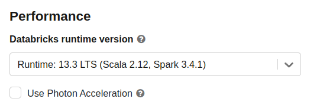
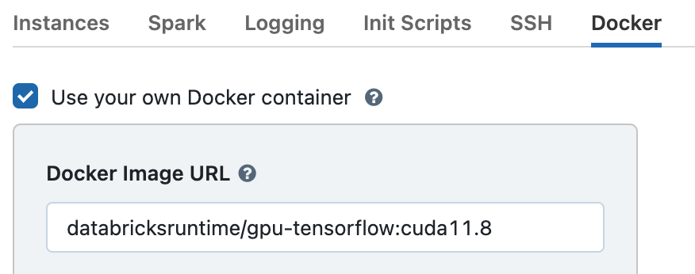

# Databricks

## Databricks Notebooks

You can install RAPIDS libraries into a Databricks GPU Notebook environment.

### Launch a single-node Databricks cluster

Navigate to the **All Purpose Compute** tab of the **Compute** section in Databricks and select **Create Compute**.


In order to launch a GPU node uncheck **Use Photon Acceleration**.



Then expand the **Advanced Options** section and open the **Docker** tab. Select **Use your own Docker container** and enter the image `databricksruntime/gpu-tensorflow:cuda11.8` or `databricksruntime/gpu-pytorch:cuda11.8`.



Once you have done this the GPU nodes should be available in the **Node type** dropdown.


```{warning}
It is also possible to use the Databricks ML GPU Runtime to enable GPU nodes, however at the time of writing the newest version (13.3 LTS ML Beta) contains an older version of `tensorflow` and `protobuf` which is not compatible with RAPIDS. So using a custom container with the latest Databricks GPU container images is recommended.
```

Select **Create Compute**.

### Install RAPIDS in your notebook

Once your cluster has started create a new notebook or open an existing one.

````{warning}
At the time of writing the `databricksruntime/gpu-pytorch:cuda11.8` image does not contain the full `cuda-toolkit` so if you selected that one you will need to install that before installing RAPIDS.

```text
!cd /etc/apt/sources.list.d && \
    mv cuda-ubuntu2204-x86_64.list.disabled cuda-ubuntu2204-x86_64.list && \
    apt-get update && apt-get --no-install-recommends -y install cuda-toolkit-11-8 && \
    mv cuda-ubuntu2204-x86_64.list cuda-ubuntu2204-x86_64.list.disabled
```

````

At the top of your notebook run any of the following `pip` install commands to install your preferred RAPIDS libraries.

```text
!pip install cudf-cu11 dask-cudf-cu11 --extra-index-url=https://pypi.nvidia.com
!pip install cuml-cu11 --extra-index-url=https://pypi.nvidia.com
!pip install cugraph-cu11 --extra-index-url=https://pypi.nvidia.com
```

### Test Rapids

```python
import cudf

gdf = cudf.DataFrame({"a":[1,2,3],"b":[4,5,6]})
gdf
    a   b
0   1   4
1   2   5
2   3   6

```

## Databricks Spark

You can also use the RAPIDS Accelerator for Apache Spark 3.x on Databricks. See the [Spark RAPIDS documentation](https://nvidia.github.io/spark-rapids/docs/get-started/getting-started-databricks.html) for more information.
