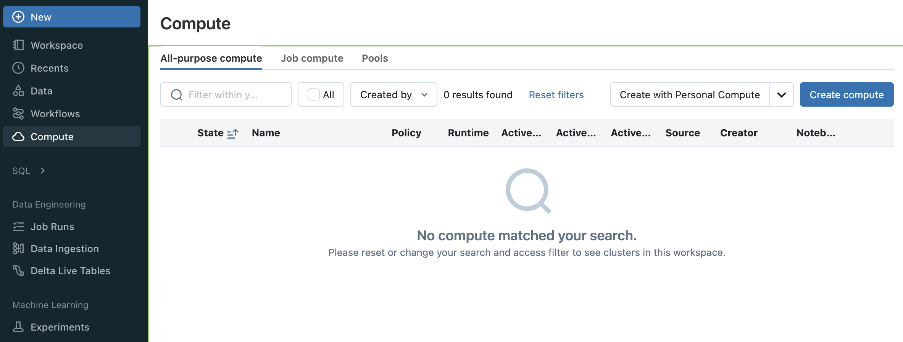
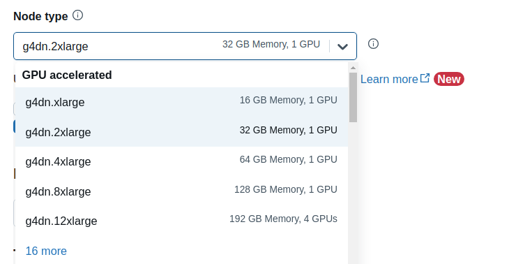
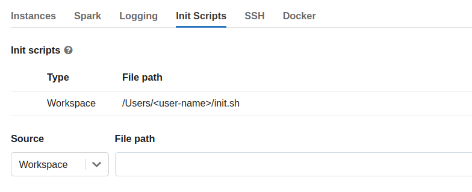

# Databricks

You can install RAPIDS on Databricks in a few different ways:

1. Accelerate machine learning workflows in a single-node GPU notebook environment
2. Spark users can install [RAPIDS Accelerator for Apache Spark 3.x on Databricks](https://docs.nvidia.com/spark-rapids/user-guide/latest/getting-started/databricks.html)
3. Install Dask alongside Spark and then use libraries like `dask-cudf` for multi-node workloads

## Single-node GPU Notebook environment

(create-init-script)=

### Create init-script

To get started, you must first configure an [initialization script](https://docs.databricks.com/en/init-scripts/index.html) to install RAPIDS libraries and all other dependencies for your project.

Databricks recommends using [cluster-scoped](https://docs.databricks.com/en/init-scripts/cluster-scoped.html) init scripts stored in the workspace files.

Navigate to the top-left **Workspace** tab and click on your **Home** directory then select **Add** > **File** from the menu. Create an `init.sh` script with contents:

```bash
#!/bin/bash
set -e

# Install RAPIDS libraries
pip install \
    --extra-index-url={{rapids_pip_index}} \
    "cudf-cu12>={{rapids_pip_version}}" "cuml-cu12>={{rapids_pip_version}}" \
    "dask-cuda>={{rapids_pip_version}}"

```

(launch-databricks-cluster)=

### Launch cluster

To get started, navigate to the **All Purpose Compute** tab of the **Compute** section in Databricks and select **Create Compute**. Name your cluster and choose **"Single node"**.



In order to launch a GPU node uncheck **Use Photon Acceleration** and select any `15.x`, `16.x` or `17.x` ML LTS runtime with GPU support.
For example for long-term support releases you could select the `15.4 LTS ML (includes Apache Spark 3.5.0, GPU, Scala 2.12)` runtime version.

The "GPU accelerated" nodes should now be available in the **Node type** dropdown.



Then expand the **Advanced Options** section, open the **Init Scripts** tab and enter the file path to the init-script in your Workspace directory starting with `/Users/<user-name>/<script-name>.sh` and click **"Add"**.



Select **Create Compute**

### Test RAPIDS

Once your cluster has started, you can create a new notebook or open an existing one from the `/Workspace` directory then attach it to your running cluster.

```python
import cudf

gdf = cudf.DataFrame({"a":[1,2,3],"b":[4,5,6]})
gdf
    a   b
0   1   4
1   2   5
2   3   6
```

#### Quickstart with cuDF Pandas

RAPIDS recently introduced cuDF’s [pandas accelerator mode](https://rapids.ai/cudf-pandas/) to accelerate existing pandas workflows with zero changes to code.

Using `cudf.pandas` in Databricks on a single-node can offer significant performance improvements over traditional pandas when dealing with large datasets; operations are optimized to run on the GPU (cuDF) whenever possible, seamlessly falling back to the CPU (pandas) when necessary, with synchronization happening in the background.

Below is a quick example how to load the `cudf.pandas` extension in a Jupyter notebook:

```python

%load_ext cudf.pandas

%%time

import pandas as pd

df = pd.read_parquet(
    "nyc_parking_violations_2022.parquet",
    columns=["Registration State", "Violation Description", "Vehicle Body Type", "Issue Date", "Summons Number"]
)

(df[["Registration State", "Violation Description"]]
 .value_counts()
 .groupby("Registration State")
 .head(1)
 .sort_index()
 .reset_index()
)
```

Upload the [10 Minutes to RAPIDS cuDF Pandas notebook](https://colab.research.google.com/drive/12tCzP94zFG2BRduACucn5Q_OcX1TUKY3) in your single-node Databricks cluster and run through the cells.

**NOTE**: cuDF pandas is open beta and under active development. You can [learn more through the documentation](https://docs.rapids.ai/api/cudf/~~~rapids_api_docs_version~~~/?_gl=1*1oyfbsi*_ga*MTc5NDYzNzYyNC4xNjgzMDc2ODc2*_ga_RKXFW6CM42*MTcwNTU4NDUyNS4yMC4wLjE3MDU1ODQ1MjUuNjAuMC4w) and the [release blog](https://developer.nvidia.com/blog/rapids-cudf-accelerates-pandas-nearly-150x-with-zero-code-changes/).
