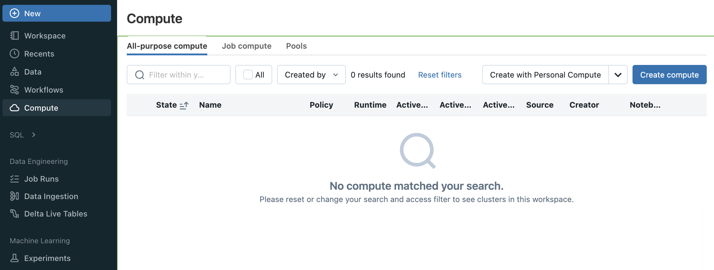
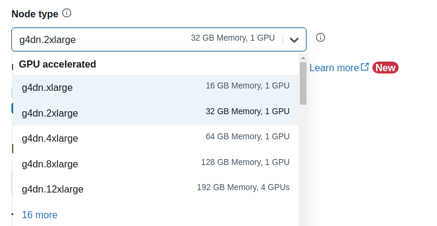
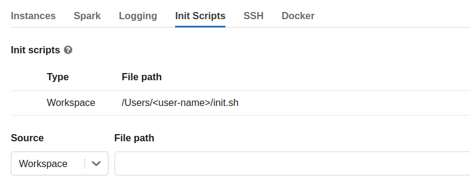
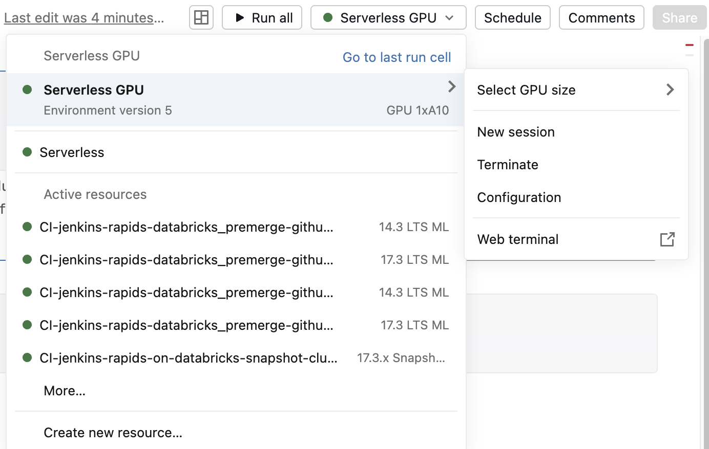

# Databricks

You can install RAPIDS on Databricks in a few different ways:

1. Accelerate machine learning workflows in a single-node GPU notebook environment on [classic compute](classic-gpu-compute)
2. Accelerate machine learning workflows in a single-node GPU notebook environment on [serverless GPU compute](serverless-gpu-compute)
3. Spark users can install [RAPIDS Accelerator for Apache Spark 3.x on Databricks](https://docs.nvidia.com/spark-rapids/user-guide/latest/getting-started/databricks.html)
4. Install Dask alongside Spark and then use libraries like `dask-cudf` for multi-node workloads

(classic-gpu-compute)=

## Classic GPU compute

(create-init-script)=

### Create init-script

To get started, you must first configure an [initialization script](https://docs.databricks.com/en/init-scripts/index.html) to install RAPIDS libraries and all other dependencies for your project.

Databricks recommends using [cluster-scoped](https://docs.databricks.com/en/init-scripts/cluster-scoped.html) init scripts stored in the workspace files.

Navigate to the top-left **Workspace** tab and click on your **Home** directory then select **Add** > **File** from the menu. Create an `init.sh` script with contents:

```bash
#!/bin/bash
set -e

# Install RAPIDS libraries
pip install \
    --extra-index-url={{rapids_pip_index}} \
    "cudf-cu{{rapids_cuda_major}}=={{rapids_pip_version}}" "cuml-cu{{rapids_cuda_major}}=={{rapids_pip_version}}"
```

(launch-databricks-cluster)=

### Launch cluster

To get started, navigate to the **All Purpose Compute** tab of the **Compute** section in Databricks and select **Create Compute**. Name your cluster and choose **"Single node"**.



In order to launch a GPU node check the **Machine Learning** box and uncheck the **Use Photon Acceleration** box just below it, then select a runtime in the dropdown.
For example you could select the `18 LTS (Scala 2.13, Spark 4.1.0)` runtime version.

The "GPU accelerated" nodes should now be available in the **Node type** dropdown.



Then expand the **Advanced Options** section, open the **Init Scripts** tab and enter the file path to the init-script in your Workspace directory starting with `/Users/<user-name>/<script-name>.sh` and click **"Add"**.



Select **Create Compute**

(serverless-gpu-compute)=

## Serverless GPU compute

[Serverless GPU compute](https://docs.databricks.com/aws/en/compute/serverless/gpu) gives you a single-node GPU notebook with no cluster to create and no init script to maintain. Databricks provisions the GPU on demand when you attach a notebook to it.

Because there is no cluster to configure, the [init script](create-init-script) approach above does not apply. Install RAPIDS from inside the notebook instead.

```{note}
Serverless GPU compute is in public preview and is only available in [certain regions](https://docs.databricks.com/aws/en/compute/serverless/gpu).
```

### Connect a notebook

Open a notebook, click the compute dropdown at the top and select **Serverless GPU**.



From the submenu select **Configuration** to open the configuration side panel. Under **Hardware** set **Accelerator** to `1xA10`, and under **Environment** set **Base environment** to **Standard v5**. Then click **Apply** and **Confirm**.

```{figure} /images/databricks-serverless-environment-panel.png
---
alt: Screenshot of the Environment side panel
width: 50%
align: center
---
```

```{note}
Choose the **Standard** environment rather than the **AI** environment. The AI environment preinstalls `cupy-cuda12x`, which conflicts with the `cupy-cuda13x` build that the RAPIDS CUDA {{rapids_cuda_major}} wheels depend on.
```

### Install RAPIDS

Install the RAPIDS libraries into your notebook environment.

```python
%pip install \
    --extra-index-url={{rapids_pip_index}} \
    "cudf-cu{{rapids_cuda_major}}=={{rapids_pip_version}}" "cuml-cu{{rapids_cuda_major}}=={{rapids_pip_version}}"
```

Then restart the Python process so that the new packages are picked up.

```python
%restart_python
```

## Test RAPIDS

You can run the following code snippet to verify that the RAPIDS libraries are installed successfully on your choice of compute.

```python
import cudf

gdf = cudf.DataFrame({"a":[1,2,3],"b":[4,5,6]})
gdf
    a   b
0   1   4
1   2   5
2   3   6
```

## Quickstart with cuDF Pandas

RAPIDS recently introduced cuDF’s [pandas accelerator mode](https://docs.nvidia.com/cudf/latest/cudf_pandas/) to accelerate existing pandas workflows with zero changes to code.

Using `cudf.pandas` in Databricks on a single-node can offer significant performance improvements over traditional pandas when dealing with large datasets; operations are optimized to run on the GPU (cuDF) whenever possible, seamlessly falling back to the CPU (pandas) when necessary, with synchronization happening in the background.

Below is a quick example how to load the `cudf.pandas` extension in a Jupyter notebook:

```python

%load_ext cudf.pandas

%%time

import pandas as pd

df = pd.read_parquet(
    "nyc_parking_violations_2022.parquet",
    columns=["Registration State", "Violation Description", "Vehicle Body Type", "Issue Date", "Summons Number"]
)

(df[["Registration State", "Violation Description"]]
 .value_counts()
 .groupby("Registration State")
 .head(1)
 .sort_index()
 .reset_index()
)
```

Upload the [10 Minutes to RAPIDS cuDF Pandas notebook](https://colab.research.google.com/drive/12tCzP94zFG2BRduACucn5Q_OcX1TUKY3) into your Databricks workspace and run through the cells.
