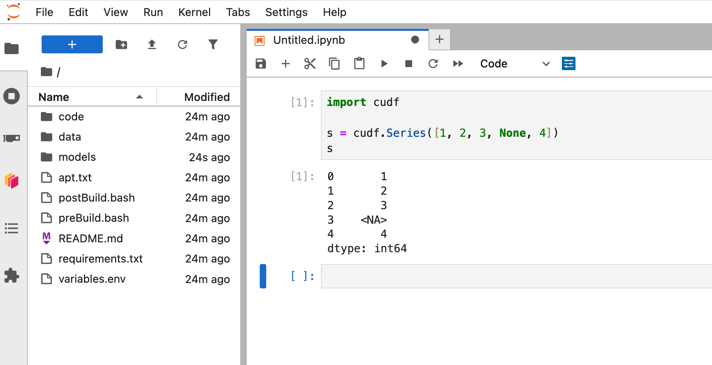

# NVIDIA AI Workbench

[NVIDIA AI Workbench](https://www.nvidia.com/en-us/deep-learning-ai/solutions/data-science/workbench/) is a developer
toolkit for data science, machine learning, and AI projects. It lets you develop on your laptop/workstation and then
easily transition workloads to scalable GPU resources in a data center or the cloud. AI Workbench is free, you can
install it in minutes on both local or remote computers, and offers a desktop application as well as a command-line
interface (CLI).

## Installation

You can install AI Workbench locally, or on a remote computer that you have SSH access to.

Follow the [AI Workbench
installation](https://docs.nvidia.com/ai-workbench/user-guide/latest/installation/overview.html) documentation for
instructions on installing on different operating systems.

```{admonition} Local GPU System
:class: note

If you are working on a system that has an NVIDIA GPU you can use the AI Workbench
by installing the desktop application and configure Docker if you don't have it installed already. Then you can run
notebooks in Python environments with access to your GPU.

```

```{admonition} Remote GPU System
:class: note

If you don't have an NVIDIA GPU in your system, but have remote SSH access to a system that does, then you can use AI
Workbench to connect to that system. Your code will be executed on the remote system, but files will be synced between
your local and remote environments automatically. This allows you to burst from a system without NVIDIA GPUs like a
lightweight laptop to a powerful remote AI system.

To use AI Workbench in this way you need to install the desktop application on your local system and the CLI application
on the remote system.
```

## Configure your system

Once you have installed AI Workbench you can launch the desktop application. On first run it will talk you through
installing some dependencies if they aren't available already.

Then you will be able to choose between using your local environment or working on a remote system (you can switch
between them later very easily).

If you wish to configure a remote system click the "Add Remote System" button and enter the configuration information
for that system.


Once configured select the system you wish to use. You will then be greeted with a screen where you can create a new
project or clone an existing one.


Select "Start a new project" and give it a name and description. You can also change the default location to store the
project files.


Then scroll down and select "RAPIDS with CUDA" from the list of templates.


The new project will then be created. AI Workbench will automatically build a container for this project, this may take
a few minutes.


Once the project has built you can select "Open Jupyterlab" to launch Jupyter in your RAPIDS environment.


Then you can start working with the RAPIDS libraries in your notebooks.



## Further reading

For more information and to learn more about what you can do with NVIDIA AI Workbench [see the
documentation](https://docs.nvidia.com/ai-workbench/user-guide/latest/overview/introduction.html).
